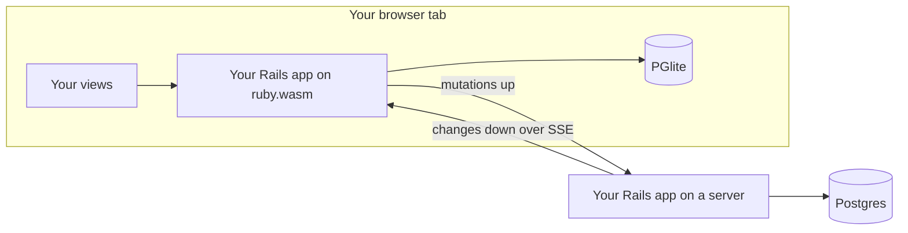

# InstantRecord

Rails models that run in the browser, sync to your server, and keep working offline.

## The Problem

Apps like Linear feel instant because they never make you wait on the network: every read and write hits a **local** database, the UI renders from local data, and syncing with the server happens in the background. No spinners, no loading states, and offline works for free.

Building that today means a JavaScript sync engine, a client-side store, an API layer, and client-side state management — a whole second data architecture that leaves Rails behind.

InstantRecord is a bet that Rails developers can have local-first without leaving Ruby:

- **Instant** — `Issue.create!` commits to a Postgres running inside the browser and the UI re-renders immediately. The network is never in the hot path.
- **Durable** — every write records a mutation in the same local transaction, so nothing is lost to a crash, a reload, or a dead connection.
- **Convergent** — a background loop drains mutations to your Rails server (the source of truth) and streams everyone else's changes back over SSE.
- **Still just Rails** — the same `ApplicationRecord` model file runs on both sides. Validations, scopes, callbacks — no API client, no duplicate schema, no JavaScript data layer.

:construction: **This is a proof of concept.** The core loop is built and demonstrated: instant optimistic writes, offline-durable outbox, two clients converging over SSE, and server rejections rolling back cleanly. See [What's proven](#whats-proven).

## The Two Runtimes

The same model file loads into two Ruby runtimes, each backed by its own Postgres:

|  | In the browser | On the server |
|---|---|---|
| Ruby | CRuby compiled to WebAssembly, inside a **service worker** | CRuby + Puma |
| Database | [PGlite](https://pglite.dev) — Postgres-in-wasm, persisted to IndexedDB | PostgreSQL |
| Writes | **Optimistic** — instant local commit, queued for sync | **Authoritative** — validated, versioned, logged |
| Your controllers & views | Run here when the page is served by the service worker | Run here at `localhost:3000` |



## Usage

### 1. Install

```ruby
# Gemfile
gem "instant_record"
```

[wasmify-rails](https://github.com/palkan/wasmify-rails) comes along as a dependency — it provides the browser build tasks and the PGlite database adapter.

### 2. Make a model syncable

This is the whole opt-in:

```ruby
class Issue < ApplicationRecord
  include InstantRecord::Syncable

  validates :title, presence: true
end
```

Syncable models need three columns — a string/uuid primary key, `server_version:integer`, and `sync_state:string`. The gem's own tables (outbox, sync metadata, change log, idempotency ledger) install automatically as engine migrations — just run `bin/rails db:migrate`.

Rules that should only run on the server (authorization, quotas, anything the client shouldn't decide) stay in the same file, scoped with a block:

```ruby
class Issue < ApplicationRecord
  include InstantRecord::Syncable

  validates :title, presence: true

  server_only do
    validate :quota_not_exceeded   # server rejects; the client rolls back
  end

  browser_only do
    after_commit :flash_confetti   # local-runtime behavior
  end
end
```

There's no server setup: the sync engine auto-mounts at `/instant_record` on the server — `POST /mutations` (batched, idempotent writes) and `GET /events` (SSE change stream) — and every model that includes `Syncable` is syncable. Two optional knobs:

```ruby
# config/application.rb — move or disable the mount
config.instant_record.mount_path = "/sync"    # or false to mount manually

# config/initializers/instant_record.rb — restrict syncing to an explicit allowlist
InstantRecord.sync(Issue, Todo)
```

### 3. Build the browser bundle

Your app compiles to a wasm module that boots in a service worker. One generator sets everything up — the wasm environment, the PGlite database config, and a PWA shell wired with the sync driver:

```sh
bin/rails generate instant_record:install
bin/rails instant_record:build     # compiles the Ruby core (once) + packs app.wasm
```

**Deploying:** the bundle is a build artifact, like precompiled assets. Either build it in your deploy pipeline with `bin/rails instant_record:build`, or opt in to building during asset precompilation:

```ruby
# config/application.rb
config.instant_record.build_on_precompile = true
```

(Off by default — the build needs the wasm toolchain and network access for ruby.wasm artifacts.)

### 4. Write your app like it's normal Rails

No special APIs in your controllers or views. When the page is served by the service worker, this code executes **in the browser**, reading and writing the local database:

```ruby
class IssuesController < ApplicationController
  def index
    @issues = Issue.order(created_at: :desc)   # instant: local Postgres read
  end

  def create
    Issue.create!(issue_params)                # instant: local commit + queued for sync
    redirect_to root_path
  end
end
```

```erb
<% @issues.each do |issue| %>
  <li>
    <%= issue.title %>
    <span class="badge"><%= issue.sync_state %></span>  <%# "pending" until the server acks %>
  </li>
<% end %>
```

Useful helpers:

- `issue.sync_state` — `"pending"` (not yet acked) or `"synced"`
- `InstantRecord.pending_count` — outbox size, for an "unsynced changes" indicator
- `InstantRecord.sync_now` — force a sync pass (the background loop runs anyway)
- `server_only { ... }` / `browser_only { ... }` — runtime-scoped model rules
- `InstantRecord.browser?` — the underlying runtime check, for anywhere else
- `InstantRecord::Client.applying_remote?` — whether the write running right now arrived from the server, rather than being made here
- `InstantRecord.server_url(path)` — the URL that reaches the authoritative server from either runtime, honouring a customised `mount_path`

Convergence is last-write-wins on `updated_at`, and the value that loses is gone from the row. A model can watch for that:

```ruby
class Issue < ApplicationRecord
  include InstantRecord::Syncable

  # A value from the server that last-write-wins threw away. The block runs with
  # the losing attribute hash at the only moment it exists here — nothing is
  # assigned, no callback fires, and the gem keeps no copy.
  on_discarded_change { |attributes| Rails.logger.info("dropped #{attributes["title"].inspect}") }
end
```

#### Server-only controller behavior: auth and scoping

Controllers load in both runtimes too — the browser runs them against local data, the server against Postgres. Anything that depends on sessions, cookies, or secrets exists only on the server, so scope it there:

```ruby
class IssuesController < ApplicationController
  extend InstantRecord::RuntimeScoped

  server_only do
    before_action :authenticate_user!   # sessions and secrets: server only
  end

  browser_only do
    skip_forgery_protection             # no CSRF secrets in the local runtime
  end

  def index
    @issues = issues_scope.order(created_at: :desc)
  end

  private

  def issues_scope
    # Server: enforce per-user scoping. Browser: the local database already
    # holds only what the server synced to this client, so Issue.all IS the
    # scoped set.
    InstantRecord.browser? ? Issue.all : current_user.issues
  end
end
```

**Where authorization actually lives:** browser-side checks are UX, never enforcement — the user owns the client and everything in it. Real enforcement has exactly two places, both on the server:

1. **The mutations endpoint** — server-side validations and `server_only` model rules reject writes the client wasn't allowed to make; the client rolls back.
2. **What you sync down** — a client can only render what the change stream delivered to it. (Per-user scoping of the stream itself — `syncable_to` — is on the roadmap; today the PoC syncs every registered model to every client.)

A `server_only` controller filter protects the server-rendered surface; it cannot and need not protect the browser's local rendering.

### 5. Sync just happens

The sync loop is Ruby, configured in Ruby:

```ruby
# config/initializers/instant_record.rb (optional — these are the defaults)
InstantRecord.configure do |config|
  config.endpoint = "/instant_record"   # absolute URL for cross-origin setups
  config.sync_interval = 3              # base backoff for retrying a stuck outbox
end
```

The browser shell calls `InstantRecord.start` once at boot; from there Ruby owns the drain, the change stream, reconnects, and reconciliation. (`InstantRecord.sync_now` forces a pass manually.) The only JavaScript left is a timer — wasm Ruby can't sleep without blocking the VM, so the service worker provides the clock and nothing else.

Behind the scenes:

- **First load** — a new client hydrates from a bootstrap snapshot (current state plus the sync cursor, windowed per model — see below) and remembers its position, so later visits paint instantly from IndexedDB and fetch only what's new.
- **Every write** — committed locally first, then delivered to the server in the background. Offline just means "delivered later"; queued writes survive reloads.
- **Other clients** — every accepted change streams to all connected clients over SSE, and their pages re-render from local data. Concurrent edits resolve last-write-wins.
- **Rejections** — if the server refuses a write (failed validation, server-only rule), the client rolls the local record back to server state and stops retrying.

### 6. Window large tables

Tables with unbounded history (chat messages, events, logs) don't have to sync whole. Declare a **sync window** and only the newest rows reach clients:

```ruby
class Message < ApplicationRecord
  include InstantRecord::Syncable

  sync_window limit: 50, partition_by: :channel_id   # newest 50 per channel
end
```

Windows order by `(created_at, id)`, so a windowed model needs a `created_at` column — and an index on `(partition, created_at, id)` keeps the queries flat at depth.

Declaring a window changes three things:

- **Fresh clients bootstrap.** A client that has never synced hydrates from `GET /instant_record/bootstrap` — current state, windowed per model, plus the change-log cursor — instead of replaying the whole change log. Windowless models still serialize in full.
- **Boot-time eviction.** On a cold boot the browser trims each windowed model back to its window per partition. Rows with `sync_state: "pending"` are never evicted.
- **History pages on demand.** Older rows stream in through keyset cursors (never OFFSET), applied idempotently with no outbox noise:

```ruby
InstantRecord.fetch_history(Message,
  partition: channel_id,
  before: { created_at: oldest.created_at.iso8601(6), id: oldest.id },
  limit: 50)
# => { ok: true, applied: 50, has_more: true }    — or :busy while a sync pass runs
```

In the browser this serves repeat scrolls and offline scrollback from the local database and only hits `GET /instant_record/records` for pages it doesn't hold. Page JavaScript reaches it through a service-worker message (never from inside a request — the wasm VM can't re-enter itself):

```js
const channel = new MessageChannel();
channel.port1.onmessage = (event) => { /* {ok, has_more, error} */ };
navigator.serviceWorker.controller.postMessage(
  { type: "instant_record.fetch_history",
    request: { type: "Message", partition: channelId,
               before: { created_at: oldestAt, id: oldestId }, limit: 50 } },
  [channel.port2],
);
```

**Render the top of the scrollback server-side.** A windowed view needs a slot above its oldest row — a scroll-up sentinel, or a "beginning of history" marker once there's nothing left. Render that slot in the initial HTML even when you don't yet know which it is, and let JavaScript fill it in place. Injecting it after a probe shifts every row below it by its height on each load.

The Slack demo's infinite scroll is the reference wiring — IntersectionObserver sentinel, scroll anchoring, in-place DOM updates — in the Stimulus controller `demo/app/javascript/controllers/conversation_controller.js`.

## Running the demo

Requirements: Ruby 3.3.3, Node, PostgreSQL, [wasmtime](https://wasmtime.dev) and [wasi-vfs](https://github.com/kateinoigakukun/wasi-vfs).

```sh
# Gem tests
bundle install && bundle exec rake test

# One-time setup
cd demo
bundle install
bin/rails db:prepare
bin/rails test
cd pwa && yarn install && cd ..

# One-time browser build (~5 min)
bin/rails instant_record:build    # writes pwa/public/app.wasm (~62 MB)

# Run it — sync server on :3000, PWA on :5173
bin/dev
```

`bin/dev` runs both processes under foreman (see `demo/Procfile.dev`): the Rails sync server, and the Vite server that hosts the service worker, `app.wasm`, and PGlite's wasm.

Open http://localhost:5173/boot.html, wait for **Service Worker Ready**, then open http://localhost:5173/ — that page is rendered by Rails in your browser.

Things to try:

- **Instant writes** — create an issue; it appears immediately with a `pending` badge that flips to `synced`.
- **Two clients** — open http://127.0.0.1:5173/ too (different origin = separate service worker + separate local database). Changes propagate between windows through the server. A fresh client catches up automatically.
- **Infinite scroll** — `/slack` seeds thousands of messages in `#general`, but a fresh client only syncs the newest 50 per conversation. Scroll to the top and older pages stream in; messages arriving mid-read update the page without a reload or a scroll jump.
- **Offline** — stop the Rails server, create issues (they stay `pending`), reload the tab (still there), restart the server and watch them drain.
- **Rejection** — create an issue titled `reject me`. It appears optimistically, the server refuses it, and it disappears on reconcile.

## Scaling the SSE stream

Every client holds one persistent SSE connection — the service worker keeps it open in JavaScript and hands each event to Ruby, because Ruby awaiting a chunk itself would suspend the sync guard and starve outbox drains for the length of the window. Concurrent streams therefore scale with open tabs; plan your server accordingly. The engine's stream endpoint is a plain Rack streaming body (no `ActionController::Live`, no thread per stream) that releases its database connection between polls, so it runs well on both servers; the ceiling is the server's concurrency model. Measured on the demo (M-series MacBook, dev mode):

| Server | Concurrent SSE clients | Result |
|---|---|---|
| Puma (3 threads default) | 2 | Works — p50 delivery 103ms |
| Puma (3 threads default) | 3 | Streams consumed every thread; the sync write itself starved — 0 delivered |
| Puma (3 threads default) | 50 | Server unresponsive for minutes (rails/rails#55762's failure mode) |
| Falcon (fiber per request) | 200 | 200/200 delivered, p50 442ms, 0 errors |
| Falcon (fiber per request) | 500 | 500/500 delivered, p50 378ms, ~13 MB RSS, 0 errors |

**Recommendation:** Puma is fine for development and a handful of clients. For SSE-heavy deployments, run [Falcon](https://github.com/socketry/falcon) — streams become fibers, `sleep` and `pg` yield to the scheduler, and thousands of idle connections are cheap:

```ruby
# Gemfile
gem "falcon", require: false
```

```ruby
# config/application.rb — fiber-scoped execution state under Falcon only
config.active_support.isolation_level = :fiber if defined?(Falcon)
```

```sh
bundle exec falcon serve --bind http://localhost:3000
```

Browser clients receive changes over that held stream — measured at **130ms** from a server-side write to the row appearing, bounded by the server's 0.5s change-log poll rather than by any client interval. Reopening with `?after=<cursor>` replays whatever a dropped connection missed, so nothing polls for changes. The tail window is configurable via `config.instant_record.sse_window_seconds`.

There is no heartbeat in the browser: a sync pass runs on a local write, at boot, and when the network returns, then retries with backoff only while the outbox still has something in it. An idle tab issues no requests at all beyond holding its stream. Reproduce the numbers with `demo/script/sse_load_spike.rb`.

## What's proven

Measured on the demo (Chrome, M-series MacBook):

- Rails 8.1.3 boots under wasm32-wasi with the full gem bundle, including this gem.
- Warm boot — VM init plus PGlite schema prepare — in **~1.8 seconds**; the `app.wasm` module is **61.9 MB** raw, **17.1 MB** gzipped over the wire.
- Instant optimistic create with local persistence across reloads.
- Two independent clients converging through POST + SSE, including fresh-client catch-up.
- Server rejection reconciled by rolling the local record back.
- ~5,000 seeded messages in one channel: a fresh client bootstraps only the newest window per conversation, older pages stream in on scroll, and a cold boot evicts the local database back to the window.
- 226 tests (116 gem + 110 demo) covering the atomic outbox, idempotent apply, last-write-wins both ways, cursor resume, rejection reconcile, bootstrap hydration, keyset history pages, eviction, migration over a populated local store, and schema skew in both directions.

## Roadmap ideas

Sketched but **not built**:

```ruby
# Model-level conflict resolution beyond last-write-wins
class Issue < ApplicationRecord
  include InstantRecord::Syncable
  resolves_conflict_on :state, prefer: :closed
end
```

Also out of scope for the PoC, on purpose: CRDTs, Postgres logical replication, multi-tab leader election, attachments, authentication/authorization on the sync endpoints, and migration generators. An Inertia-compatible layer (server-seeded props hydrating the local database, plus a JS read surface via PGlite live queries) is captured as a follow-up direction in `docs/plans/`.

## History

View the [changelog](CHANGELOG.md).

## Contributing

Everyone is encouraged to help improve this project. Here are a few ways you can help:

- [Report bugs](https://github.com/kieranklaassen/instant_record/issues)
- Fix bugs and [submit pull requests](https://github.com/kieranklaassen/instant_record/pulls)
- Write, clarify, or fix documentation
- Suggest or add new features

To get started with development:

```sh
git clone https://github.com/kieranklaassen/instant_record.git
cd instant_record
bundle install
bundle exec rake test
```
