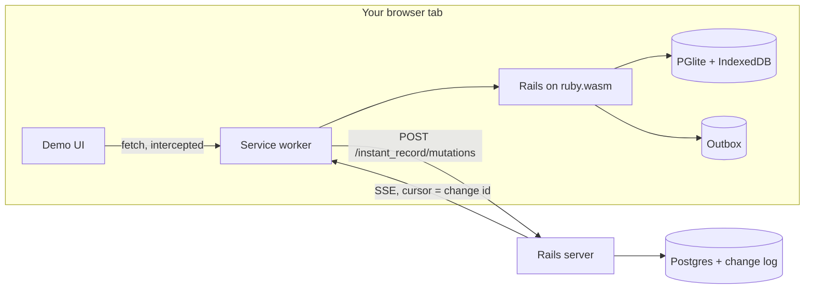

# InstantRecord

Rails models that run in the browser, sync to your server, and keep working offline.

## The Problem

Apps like Linear feel instant because they never make you wait on the network: every read and write hits a **local** database, the UI renders from local data, and syncing with the server happens in the background. No spinners, no loading states, and offline works for free.

Building that today means a JavaScript sync engine, a client-side store, an API layer, and client-side state management — a whole second data architecture that leaves Rails behind.

InstantRecord is a bet that Rails developers can have local-first without leaving Ruby:

- **Instant** — `Issue.create!` commits to a Postgres running inside the browser and the UI re-renders immediately. The network is never in the hot path; p99 interaction latency is a local database write, not a round trip.
- **Durable** — every write records a mutation in the same local transaction, so nothing is lost to a crash, a reload, or a dead connection.
- **Convergent** — a background loop drains mutations to your Rails server (the source of truth) and streams everyone else's changes back over SSE.
- **Still just Rails** — the same `ApplicationRecord` model file runs on both sides. Validations, scopes, callbacks — no API client, no duplicate schema, no JavaScript data layer.

:construction: **This is a proof of concept.** The core loop is built and demonstrated: instant optimistic writes, offline-durable outbox, two clients converging over SSE, and server rejections rolling back cleanly. See [What's proven](#whats-proven) for measured results and [Roadmap ideas](#roadmap-ideas) for the parts that are still sketches.

## The Two Runtimes

The whole idea of InstantRecord is that **the same model file loads into two different Ruby runtimes**. There is no JavaScript data layer and no API client — it's Active Record in both places, backed by a different Postgres in each:

|  | In the browser | On the server |
|---|---|---|
| Ruby | CRuby compiled to WebAssembly, running inside a **service worker** | CRuby + Puma |
| Rails | The full app, booted from an `app.wasm` bundle | The same app, `rails server` |
| Database | [PGlite](https://pglite.dev) — Postgres-in-wasm, persisted to IndexedDB | PostgreSQL |
| `app/models/issue.rb` | Loaded — writes are **optimistic**: local commit + outbox row in one transaction | Loaded — writes are **authoritative**: applied via the sync endpoint |
| Role in sync | Drains its outbox up over HTTP; applies changes coming down over SSE | Validates, versions, appends a change log, streams it out over SSE |



## Where does the browser Ruby actually run?

Not in the JS console. The service worker hosts a Ruby VM booted from `app.wasm`. When the demo tab requests a page, the service worker intercepts the fetch and hands it to **Rails running inside your browser** — routing, controller, Active Record, view render, all local, zero network.

So when this controller action runs:

```ruby
# demo/app/controllers/issues_controller.rb
def create
  Issue.create!(issue_params)   # <- executes in the browser's Ruby VM
  redirect_to root_path
end
```

`Issue.create!` commits to PGlite in your tab and the redirect re-renders from local data — the whole round trip happens on your machine. The **same file** also runs on the server at `localhost:3000`, where `Issue.create!` writes to real Postgres instead.

The model is one file, two runtimes:

```ruby
# demo/app/models/issue.rb — loaded by BOTH runtimes
class Issue < ApplicationRecord
  include InstantRecord::Syncable

  validates :title, presence: true

  # Server-only rule: the browser accepts this write optimistically,
  # the server rejects it, and the client rolls back on reconcile.
  unless InstantRecord.browser?
    validates :title, exclusion: { in: ["reject me"] }
  end
end
```

`InstantRecord::Syncable` is inert on the server beyond shared conventions (UUID ids, `server_version`, `sync_state`). In the browser it intercepts every write.

## The Full Loop, With Code

Life of a todo, from empty browser to two synced clients. All snippets are (condensed) real code from this repo.

### 1. First load: the local database hydrates itself

A brand-new client has an empty PGlite. It doesn't call a REST API to fill it — it replays the server's **change log**. The server keeps one append-only log of every accepted change, and streams it over SSE with the log id as the event id:

```ruby
# app/controllers/instant_record/events_controller.rb (engine — runs on the SERVER)
cursor = (request.headers["Last-Event-ID"] || params[:after] || 0).to_i

Change.after(cursor).each do |change|
  response.stream.write("id: #{change.id}\n")
  response.stream.write("event: change\n")
  response.stream.write("data: #{change.as_event.to_json}\n\n")
end
```

The browser applies each event to its local Postgres and advances a persisted cursor:

```ruby
# lib/instant_record/client.rb (gem — runs IN THE BROWSER VM)
def apply_change(json)
  event = JSON.parse(json)
  model = synced_model(event["type"])          # e.g. Issue

  Client.applying_remote do                    # never re-enqueues to the outbox
    upsert_from_server(model, event["attributes"], event["version"])
  end

  self.cursor = event["cursor"]                # survives reloads (stored in PGlite)
end
```

A fresh client connects with cursor `0` and receives the whole history; from then on the rows, the cursor, and the database itself live in **IndexedDB**, so the next visit paints instantly from local data and only replays the delta since its cursor. (Replaying the full log as bootstrap is PoC-grade — a server-seeded snapshot is the roadmap fix.)

### 2. Rendering: it's just Rails, reading the local database

The service worker intercepts the tab's requests and hands them to Rails running in wasm. A page render is a normal controller + ERB pass — except `Issue.order(...)` reads PGlite *in your tab*, so there is no network and no loading state:

```ruby
# demo/app/controllers/issues_controller.rb — executes IN THE BROWSER
def index
  @issues = Issue.order(created_at: :desc)   # local Postgres read, ~instant
end
```

```erb
<%# demo/app/views/issues/index.html.erb %>
<% @issues.each do |issue| %>
  <li>
    <%= issue.title %>
    <span class="badge"><%= issue.sync_state %></span>  <%# pending / synced %>
  </li>
<% end %>
```

Server-rendered HTML, where the server is your tab.

### 3. A write: commit locally, queue durably — one transaction

Submitting the form runs `Issue.create!` in the browser VM. The `Syncable` concern makes every write also record an outbox mutation **inside the same local transaction** — commit both or neither, so a crash or closed tab can never lose an unsent write:

```ruby
# lib/instant_record/syncable.rb (gem) — write interception, browser only
before_save { self.sync_state = "pending" }

# after_create runs INSIDE the wrapping transaction (unlike after_commit):
after_create { record_outbox_mutation("create") }

def record_outbox_mutation(operation)
  InstantRecord::OutboxMutation.create!(
    record_type: self.class.name,
    record_id: id,
    operation: operation,
    changes_payload: attributes.except("sync_state"),
    base_version: self[:server_version] || 0
  )
end
```

The redirect re-renders from local data immediately — the new todo is on screen with a `pending` badge before any network happens. If you're offline, it simply stays `pending`.

### 4. Background drain: the outbox goes up

The service worker periodically (and right after every write) ships pending mutations to the real server. This is the only JavaScript in the loop — Ruby owns the semantics, JS just moves JSON, because wasm Ruby can't own `fetch`:

```js
// demo/pwa/rails.sw.js (service worker)
const pending = (await vm.evalAsync("InstantRecord.pending_mutations_json")).toString();
const mutations = JSON.parse(pending);
if (mutations.length === 0) return;

const res = await fetch(`${SYNC_SERVER}/mutations`, {
  method: "POST",
  headers: { "Content-Type": "application/json" },
  body: JSON.stringify({ mutations }),
});

const { results } = await res.json();
// hand the verdicts back to Ruby: ack -> synced, rejection -> rollback
await resultsProc.callAsync("call", vm.wrap(JSON.stringify(results)));
```

The server applies each mutation in **one Postgres transaction** — record write, version bump, change-log row, idempotency-ledger row (replaying the same mutation UUID returns the original result instead of applying twice):

```ruby
# app/controllers/instant_record/mutations_controller.rb (engine — SERVER)
ActiveRecord::Base.transaction do
  record.assign_attributes(changes.except("id", "server_version"))
  record.server_version += 1
  record.save!                                # server validations run here
  Change.create!(record_type:, record_id:, operation: "update",
                 version: record.server_version, attributes_payload: record.attributes)
end
```

An ack flips the local badge to `synced`. A rejection (failed server validation) removes the mutation from the outbox and reconciles the local row back to server state — a rejected create disappears entirely.

### 5. Fan-out: everyone else re-renders

That change-log row immediately streams to every other connected client (step 1's SSE endpoint). Each client applies it to its local PGlite — with a last-write-wins guard so a stale remote change never clobbers a newer local one — and tells its open tabs:

```js
// demo/pwa/rails.sw.js — for each SSE event:
await applyProc.callAsync("call", vm.wrap(JSON.stringify(event)));  // Ruby applies it locally
clients.forEach((c) => c.postMessage({ type: "records_changed" }));
```

```html
<script>
  // the page: something changed locally -> re-render from local data
  navigator.serviceWorker.addEventListener("message", (event) => {
    if (event.data.type === "records_changed") window.location.reload();
  });
</script>
```

The reload re-runs step 2 — browser Rails renders from local PGlite — so the other window shows the new todo about a second later, without ever fetching data from a server in its render path.

That's the whole trick: **the UI only ever talks to the local database; the network only ever moves the change log.**

## Running the demo

Requirements: Ruby 3.3.3 (the known-good version for wasm builds), Node, PostgreSQL, [wasmtime](https://wasmtime.dev) and [wasi-vfs](https://github.com/kateinoigakukun/wasi-vfs) for build verification.

```sh
# Gem tests
bundle install && bundle exec rake test

# Server side
cd demo
bundle install
bin/rails db:prepare
bin/rails test
bin/rails server                  # sync server on :3000

# Browser side (one-time build, ~5 min: compiles ruby.wasm + packs the app)
bin/rails wasmify:build:core
bin/rails wasmify:pack            # writes pwa/public/app.wasm (~83 MB)
cd pwa && yarn install && yarn dev --host
```

Open http://localhost:5173/boot.html, wait for **Service Worker Ready**, then open http://localhost:5173/ — that page is rendered by Rails in your browser.

Things to try:

- **Instant writes** — create an issue; it appears immediately with a `pending` badge that flips to `synced`.
- **Two clients** — open http://127.0.0.1:5173/ too (different origin = separate service worker + separate PGlite). Changes propagate between the windows through the server's SSE stream. A fresh client catches up from the change log automatically.
- **Offline** — stop the Rails server, create issues (they stay `pending`), reload the tab (still there), restart the server and watch them drain.
- **Rejection** — create an issue titled `reject me`. It appears optimistically, the server refuses it, and it disappears on reconcile.

## What's proven

Measured on the demo (Chrome, M-series MacBook):

- Rails 8.1.3 boots under wasm32-wasi with the full gem bundle, including this gem.
- Warm boot — VM init plus PGlite schema prepare — in **~1.8 seconds**; the `app.wasm` module is **82.7 MB** raw.
- Instant optimistic create with local persistence across reloads.
- Two independent clients converging through POST + SSE, including fresh-client catch-up from cursor 0.
- Server rejection reconciled by rolling the local record back.
- 28 tests (gem + demo) covering the atomic outbox, idempotent apply, LWW both ways, cursor resume, and rejection reconcile.

## What the gem provides today

- `InstantRecord::Syncable` — UUID ids, `sync_state`, and browser-side write interception with an atomic outbox.
- `InstantRecord::Engine` — mount it for `POST /mutations` (idempotent, batched) and `GET /events` (SSE with cursor resume).
- `InstantRecord.sync Issue, ...` — the server-side allowlist of syncable models.
- `InstantRecord.browser?` — runtime check, used for things like server-only validations.
- Browser sync primitives the service worker drives: `InstantRecord.pending_count`, `pending_mutations_json`, `apply_results(json)`, `apply_change(json)`, and a persisted SSE cursor.

In the PoC, the sync *loop* (when to drain, when to reconnect) lives in the service worker JavaScript — Ruby owns all sync semantics; JS only moves JSON across the network, since wasm Ruby cannot own `fetch` or `EventSource`.

## Roadmap ideas

Sketched but **not built**:

```ruby
# A Ruby-facing sync API instead of the JS-driven loop
InstantRecord.configure { |c| c.endpoint = "https://example.com/instant_record" }
InstantRecord.start

# Model-level conflict resolution beyond last-write-wins
class Issue < ApplicationRecord
  include InstantRecord::Syncable
  resolves_conflict_on :state, prefer: :closed
end
```

Also out of scope for the PoC, on purpose: CRDTs, Postgres logical replication, multi-tab leader election, attachments, and authentication/authorization on the sync endpoints. An Inertia-compatible layer (server-seeded props hydrating the local database, plus a JS read surface via PGlite live queries) is captured as a follow-up direction in `docs/plans/`.

## History

View the [changelog](CHANGELOG.md).

## Contributing

Everyone is encouraged to help improve this project. Here are a few ways you can help:

- [Report bugs](https://github.com/kieranklaassen/instant_record/issues)
- Fix bugs and [submit pull requests](https://github.com/kieranklaassen/instant_record/pulls)
- Write, clarify, or fix documentation
- Suggest or add new features

To get started with development:

```sh
git clone https://github.com/kieranklaassen/instant_record.git
cd instant_record
bundle install
bundle exec rake test
```
