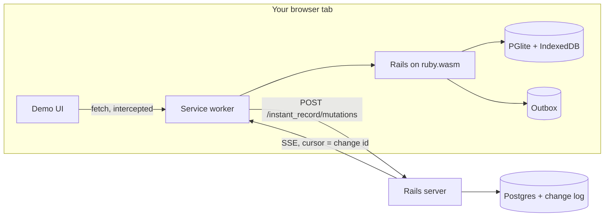

# InstantRecord

Rails models that run in the browser, sync to your server, and keep working offline.

:construction: **This is a proof of concept.** The core loop is built and demonstrated: instant optimistic writes, offline-durable outbox, two clients converging over SSE, and server rejections rolling back cleanly. See [What's proven](#whats-proven) for measured results and [Roadmap ideas](#roadmap-ideas) for the parts that are still sketches.

## The Two Runtimes

The whole idea of InstantRecord is that **the same model file loads into two different Ruby runtimes**. There is no JavaScript data layer and no API client — it's Active Record in both places, backed by a different Postgres in each:

|  | In the browser | On the server |
|---|---|---|
| Ruby | CRuby compiled to WebAssembly, running inside a **service worker** | CRuby + Puma |
| Rails | The full app, booted from an `app.wasm` bundle | The same app, `rails server` |
| Database | [PGlite](https://pglite.dev) — Postgres-in-wasm, persisted to IndexedDB | PostgreSQL |
| `app/models/issue.rb` | Loaded — writes are **optimistic**: local commit + outbox row in one transaction | Loaded — writes are **authoritative**: applied via the sync endpoint |
| Role in sync | Drains its outbox up over HTTP; applies changes coming down over SSE | Validates, versions, appends a change log, streams it out over SSE |



## Where does the browser Ruby actually run?

Not in the JS console. The service worker hosts a Ruby VM booted from `app.wasm`. When the demo tab requests a page, the service worker intercepts the fetch and hands it to **Rails running inside your browser** — routing, controller, Active Record, view render, all local, zero network.

So when this controller action runs:

```ruby
# demo/app/controllers/issues_controller.rb
def create
  Issue.create!(issue_params)   # <- executes in the browser's Ruby VM
  redirect_to root_path
end
```

`Issue.create!` commits to PGlite in your tab and the redirect re-renders from local data — the whole round trip happens on your machine. The **same file** also runs on the server at `localhost:3000`, where `Issue.create!` writes to real Postgres instead.

The model is one file, two runtimes:

```ruby
# demo/app/models/issue.rb — loaded by BOTH runtimes
class Issue < ApplicationRecord
  include InstantRecord::Syncable

  validates :title, presence: true

  # Server-only rule: the browser accepts this write optimistically,
  # the server rejects it, and the client rolls back on reconcile.
  unless InstantRecord.browser?
    validates :title, exclusion: { in: ["reject me"] }
  end
end
```

`InstantRecord::Syncable` is inert on the server beyond shared conventions (UUID ids, `server_version`, `sync_state`). In the browser it intercepts every write.

## How a write flows

1. You submit the form; the service worker routes it to browser Rails.
2. `Issue.create!` runs in wasm: **one local PGlite transaction** writes the row *and* an outbox mutation — a crash can never lose an unsent write.
3. The page re-renders from local data instantly. The issue shows a `pending` badge.
4. The service worker drains the outbox: `POST /instant_record/mutations` to the real server, with client-generated mutation UUIDs.
5. The server applies each mutation in **one Postgres transaction**: record write, `server_version` bump, change-log row, idempotency-ledger row. Replays return the original result. Conflicts resolve last-write-wins by `updated_at`.
6. The change streams to every connected client over SSE; the change-log id is the event id, so a reconnecting client resumes from a cursor instead of refetching.
7. Ack flips the badge to `synced`. A rejection removes the mutation from the outbox and reconciles the local row to server state (a rejected create is rolled back entirely).

Offline is not a special mode: steps 1–3 work with no server; steps 4–7 happen whenever connectivity returns. Local data and the outbox survive tab reloads via IndexedDB.

## Running the demo

Requirements: Ruby 3.3.3 (the known-good version for wasm builds), Node, PostgreSQL, [wasmtime](https://wasmtime.dev) and [wasi-vfs](https://github.com/kateinoigakukun/wasi-vfs) for build verification.

```sh
# Gem tests
bundle install && bundle exec rake test

# Server side
cd demo
bundle install
bin/rails db:prepare
bin/rails test
bin/rails server                  # sync server on :3000

# Browser side (one-time build, ~5 min: compiles ruby.wasm + packs the app)
bin/rails wasmify:build:core
bin/rails wasmify:pack            # writes pwa/public/app.wasm (~83 MB)
cd pwa && yarn install && yarn dev --host
```

Open http://localhost:5173/boot.html, wait for **Service Worker Ready**, then open http://localhost:5173/ — that page is rendered by Rails in your browser.

Things to try:

- **Instant writes** — create an issue; it appears immediately with a `pending` badge that flips to `synced`.
- **Two clients** — open http://127.0.0.1:5173/ too (different origin = separate service worker + separate PGlite). Changes propagate between the windows through the server's SSE stream. A fresh client catches up from the change log automatically.
- **Offline** — stop the Rails server, create issues (they stay `pending`), reload the tab (still there), restart the server and watch them drain.
- **Rejection** — create an issue titled `reject me`. It appears optimistically, the server refuses it, and it disappears on reconcile.

## What's proven

Measured on the demo (Chrome, M-series MacBook):

- Rails 8.1.3 boots under wasm32-wasi with the full gem bundle, including this gem.
- Warm boot — VM init plus PGlite schema prepare — in **~1.8 seconds**; the `app.wasm` module is **82.7 MB** raw.
- Instant optimistic create with local persistence across reloads.
- Two independent clients converging through POST + SSE, including fresh-client catch-up from cursor 0.
- Server rejection reconciled by rolling the local record back.
- 28 tests (gem + demo) covering the atomic outbox, idempotent apply, LWW both ways, cursor resume, and rejection reconcile.

## What the gem provides today

- `InstantRecord::Syncable` — UUID ids, `sync_state`, and browser-side write interception with an atomic outbox.
- `InstantRecord::Engine` — mount it for `POST /mutations` (idempotent, batched) and `GET /events` (SSE with cursor resume).
- `InstantRecord.sync Issue, ...` — the server-side allowlist of syncable models.
- `InstantRecord.browser?` — runtime check, used for things like server-only validations.
- Browser sync primitives the service worker drives: `InstantRecord.pending_count`, `pending_mutations_json`, `apply_results(json)`, `apply_change(json)`, and a persisted SSE cursor.

In the PoC, the sync *loop* (when to drain, when to reconnect) lives in the service worker JavaScript — Ruby owns all sync semantics; JS only moves JSON across the network, since wasm Ruby cannot own `fetch` or `EventSource`.

## Roadmap ideas

Sketched but **not built**:

```ruby
# A Ruby-facing sync API instead of the JS-driven loop
InstantRecord.configure { |c| c.endpoint = "https://example.com/instant_record" }
InstantRecord.start

# Model-level conflict resolution beyond last-write-wins
class Issue < ApplicationRecord
  include InstantRecord::Syncable
  resolves_conflict_on :state, prefer: :closed
end
```

Also out of scope for the PoC, on purpose: CRDTs, Postgres logical replication, multi-tab leader election, attachments, and authentication/authorization on the sync endpoints. An Inertia-compatible layer (server-seeded props hydrating the local database, plus a JS read surface via PGlite live queries) is captured as a follow-up direction in `docs/plans/`.

## History

View the [changelog](CHANGELOG.md).

## Contributing

Everyone is encouraged to help improve this project. Here are a few ways you can help:

- [Report bugs](https://github.com/kieranklaassen/instant_record/issues)
- Fix bugs and [submit pull requests](https://github.com/kieranklaassen/instant_record/pulls)
- Write, clarify, or fix documentation
- Suggest or add new features

To get started with development:

```sh
git clone https://github.com/kieranklaassen/instant_record.git
cd instant_record
bundle install
bundle exec rake test
```
