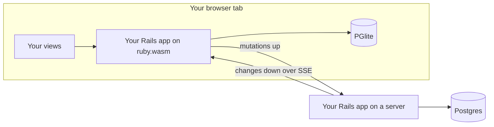

# InstantRecord

Rails models that run in the browser, sync to your server, and keep working offline.

## The Problem

Apps like Linear feel instant because they never make you wait on the network: every read and write hits a **local** database, the UI renders from local data, and syncing with the server happens in the background. No spinners, no loading states, and offline works for free.

Building that today means a JavaScript sync engine, a client-side store, an API layer, and client-side state management — a whole second data architecture that leaves Rails behind.

InstantRecord is a bet that Rails developers can have local-first without leaving Ruby:

- **Instant** — `Issue.create!` commits to a Postgres running inside the browser and the UI re-renders immediately. The network is never in the hot path.
- **Durable** — every write records a mutation in the same local transaction, so nothing is lost to a crash, a reload, or a dead connection.
- **Convergent** — a background loop drains mutations to your Rails server (the source of truth) and streams everyone else's changes back over SSE.
- **Still just Rails** — the same `ApplicationRecord` model file runs on both sides. Validations, scopes, callbacks — no API client, no duplicate schema, no JavaScript data layer.

:construction: **This is a proof of concept.** The core loop is built and demonstrated: instant optimistic writes, offline-durable outbox, two clients converging over SSE, and server rejections rolling back cleanly. See [What's proven](#whats-proven).

## The Two Runtimes

The same model file loads into two Ruby runtimes, each backed by its own Postgres:

|  | In the browser | On the server |
|---|---|---|
| Ruby | CRuby compiled to WebAssembly, inside a **service worker** | CRuby + Puma |
| Database | [PGlite](https://pglite.dev) — Postgres-in-wasm, persisted to IndexedDB | PostgreSQL |
| Writes | **Optimistic** — instant local commit, queued for sync | **Authoritative** — validated, versioned, logged |
| Your controllers & views | Run here when the page is served by the service worker | Run here at `localhost:3000` |



## Usage

### 1. Install

```ruby
# Gemfile
gem "instant_record"
gem "wasmify-rails", group: [:development, :wasm]   # builds the browser bundle
```

### 2. Make a model syncable

This is the whole opt-in:

```ruby
class Issue < ApplicationRecord
  include InstantRecord::Syncable

  validates :title, presence: true
end
```

Syncable models need three columns — a string/uuid primary key, `server_version:integer`, and `sync_state:string` — plus two client-side tables (outbox and sync metadata). In the PoC you copy the migrations from `demo/db/migrate/`; a generator is future work.

Rules that should only run on the server (authorization, quotas, anything the client shouldn't decide) stay in the same file:

```ruby
class Issue < ApplicationRecord
  include InstantRecord::Syncable

  validates :title, presence: true

  unless InstantRecord.browser?
    validate :quota_not_exceeded   # server rejects; the client rolls back
  end
end
```

### 3. Mount the sync server

```ruby
# config/routes.rb
mount InstantRecord::Engine, at: "/instant_record" unless InstantRecord.browser?
```

```ruby
# config/initializers/instant_record.rb
Rails.application.config.to_prepare do
  InstantRecord.sync(Issue)   # allowlist of models clients may sync
end
```

That gives you `POST /instant_record/mutations` (batched, idempotent writes) and `GET /instant_record/events` (SSE change stream) — the engine handles both.

### 4. Build the browser bundle

Your app compiles to a wasm module that boots in a service worker:

```sh
bin/rails wasmify:install    # one-time setup (creates the wasm env + pwa/ shell)
bin/rails wasmify:pack       # packs your app + Ruby into app.wasm
```

Point the wasm environment at PGlite:

```yaml
# config/database.yml
wasm:
  adapter: pglite
  js_interface: pglite4rails
```

The generated `pwa/` shell boots the VM, opens the PGlite database, and runs the sync loop. The PoC's working version lives in `demo/pwa/` — copy it.

### 5. Write your app like it's normal Rails

No special APIs in your controllers or views. When the page is served by the service worker, this code executes **in the browser**, reading and writing the local database:

```ruby
class IssuesController < ApplicationController
  def index
    @issues = Issue.order(created_at: :desc)   # instant: local Postgres read
  end

  def create
    Issue.create!(issue_params)                # instant: local commit + queued for sync
    redirect_to root_path
  end
end
```

```erb
<% @issues.each do |issue| %>
  <li>
    <%= issue.title %>
    <span class="badge"><%= issue.sync_state %></span>  <%# "pending" until the server acks %>
  </li>
<% end %>
```

Useful helpers:

- `issue.sync_state` — `"pending"` (not yet acked) or `"synced"`
- `InstantRecord.pending_count` — outbox size, for an "unsynced changes" indicator
- `InstantRecord.browser?` — which runtime am I in?

### 6. Sync just happens

You don't write sync code. Behind the scenes:

- **First load** — a new client hydrates its local database from the server automatically and remembers its position, so later visits paint instantly from IndexedDB and fetch only what's new.
- **Every write** — committed locally first, then delivered to the server in the background. Offline just means "delivered later"; queued writes survive reloads.
- **Other clients** — every accepted change streams to all connected clients over SSE, and their pages re-render from local data. Concurrent edits resolve last-write-wins.
- **Rejections** — if the server refuses a write (failed validation, server-only rule), the client rolls the local record back to server state and stops retrying.

## Running the demo

Requirements: Ruby 3.3.3, Node, PostgreSQL, [wasmtime](https://wasmtime.dev) and [wasi-vfs](https://github.com/kateinoigakukun/wasi-vfs).

```sh
# Gem tests
bundle install && bundle exec rake test

# Server side
cd demo
bundle install
bin/rails db:prepare
bin/rails test
bin/rails server                  # sync server on :3000

# Browser side (one-time build, ~5 min)
bin/rails wasmify:build:core
bin/rails wasmify:pack            # writes pwa/public/app.wasm (~83 MB)
cd pwa && yarn install && yarn dev --host
```

Open http://localhost:5173/boot.html, wait for **Service Worker Ready**, then open http://localhost:5173/ — that page is rendered by Rails in your browser.

Things to try:

- **Instant writes** — create an issue; it appears immediately with a `pending` badge that flips to `synced`.
- **Two clients** — open http://127.0.0.1:5173/ too (different origin = separate service worker + separate local database). Changes propagate between windows through the server. A fresh client catches up automatically.
- **Offline** — stop the Rails server, create issues (they stay `pending`), reload the tab (still there), restart the server and watch them drain.
- **Rejection** — create an issue titled `reject me`. It appears optimistically, the server refuses it, and it disappears on reconcile.

## What's proven

Measured on the demo (Chrome, M-series MacBook):

- Rails 8.1.3 boots under wasm32-wasi with the full gem bundle, including this gem.
- Warm boot — VM init plus PGlite schema prepare — in **~1.8 seconds**; the `app.wasm` module is **82.7 MB** raw.
- Instant optimistic create with local persistence across reloads.
- Two independent clients converging through POST + SSE, including fresh-client catch-up.
- Server rejection reconciled by rolling the local record back.
- 28 tests (gem + demo) covering the atomic outbox, idempotent apply, last-write-wins both ways, cursor resume, and rejection reconcile.

## Roadmap ideas

Sketched but **not built**:

```ruby
# A Ruby-facing sync API instead of the JS-driven loop
InstantRecord.configure { |c| c.endpoint = "https://example.com/instant_record" }
InstantRecord.start

# Model-level conflict resolution beyond last-write-wins
class Issue < ApplicationRecord
  include InstantRecord::Syncable
  resolves_conflict_on :state, prefer: :closed
end
```

Also out of scope for the PoC, on purpose: CRDTs, Postgres logical replication, multi-tab leader election, attachments, authentication/authorization on the sync endpoints, migration generators, and a server-seeded bootstrap snapshot (new clients currently replay the full change log). An Inertia-compatible layer (server-seeded props hydrating the local database, plus a JS read surface via PGlite live queries) is captured as a follow-up direction in `docs/plans/`.

## History

View the [changelog](CHANGELOG.md).

## Contributing

Everyone is encouraged to help improve this project. Here are a few ways you can help:

- [Report bugs](https://github.com/kieranklaassen/instant_record/issues)
- Fix bugs and [submit pull requests](https://github.com/kieranklaassen/instant_record/pulls)
- Write, clarify, or fix documentation
- Suggest or add new features

To get started with development:

```sh
git clone https://github.com/kieranklaassen/instant_record.git
cd instant_record
bundle install
bundle exec rake test
```
