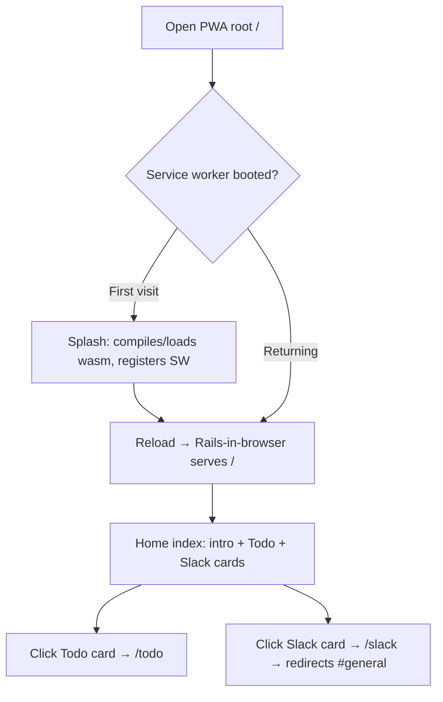
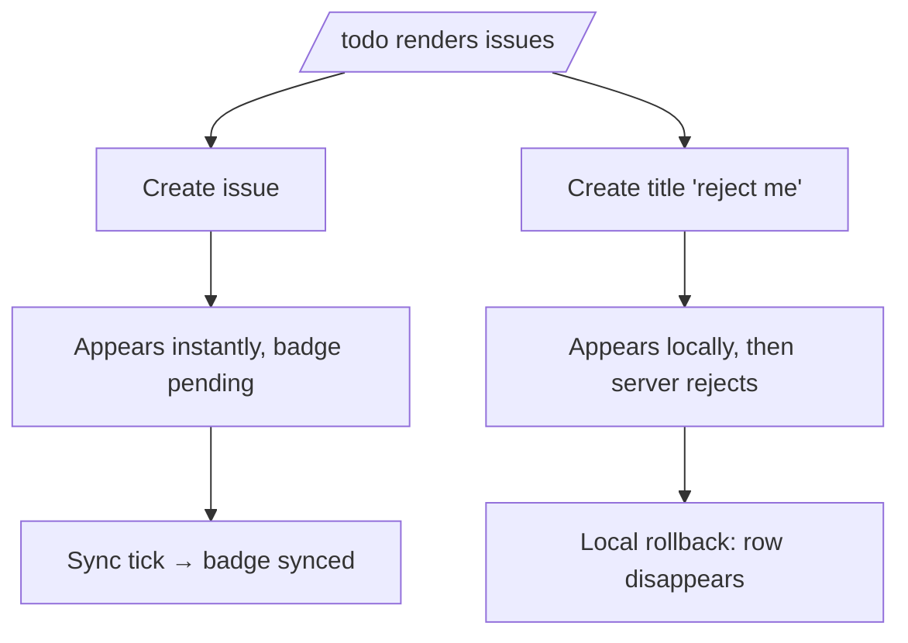
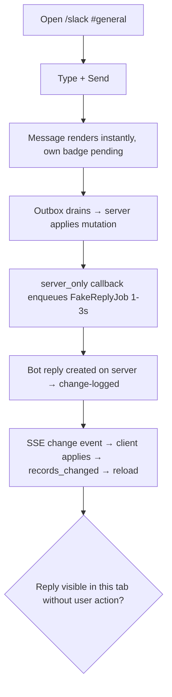
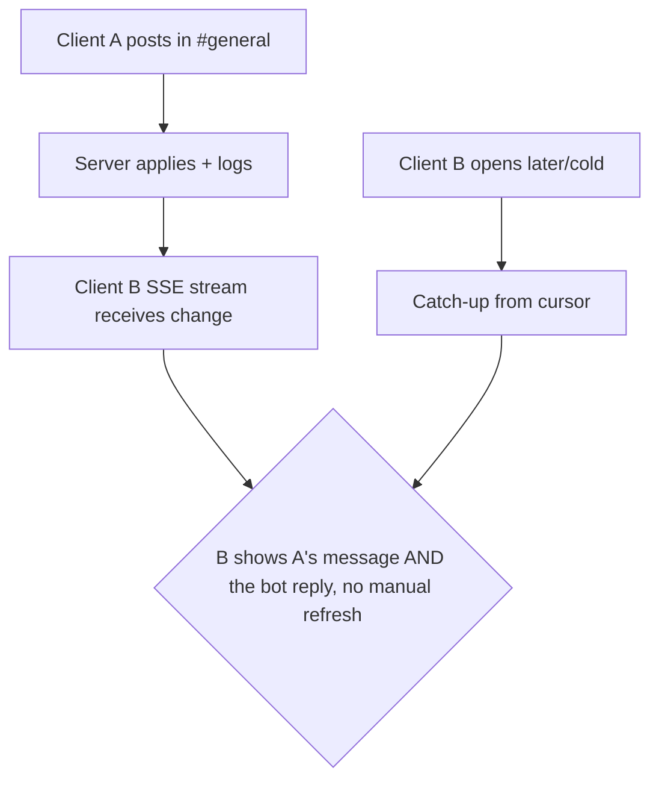
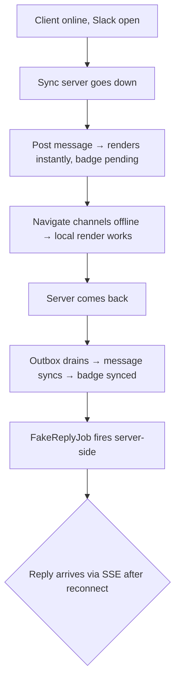
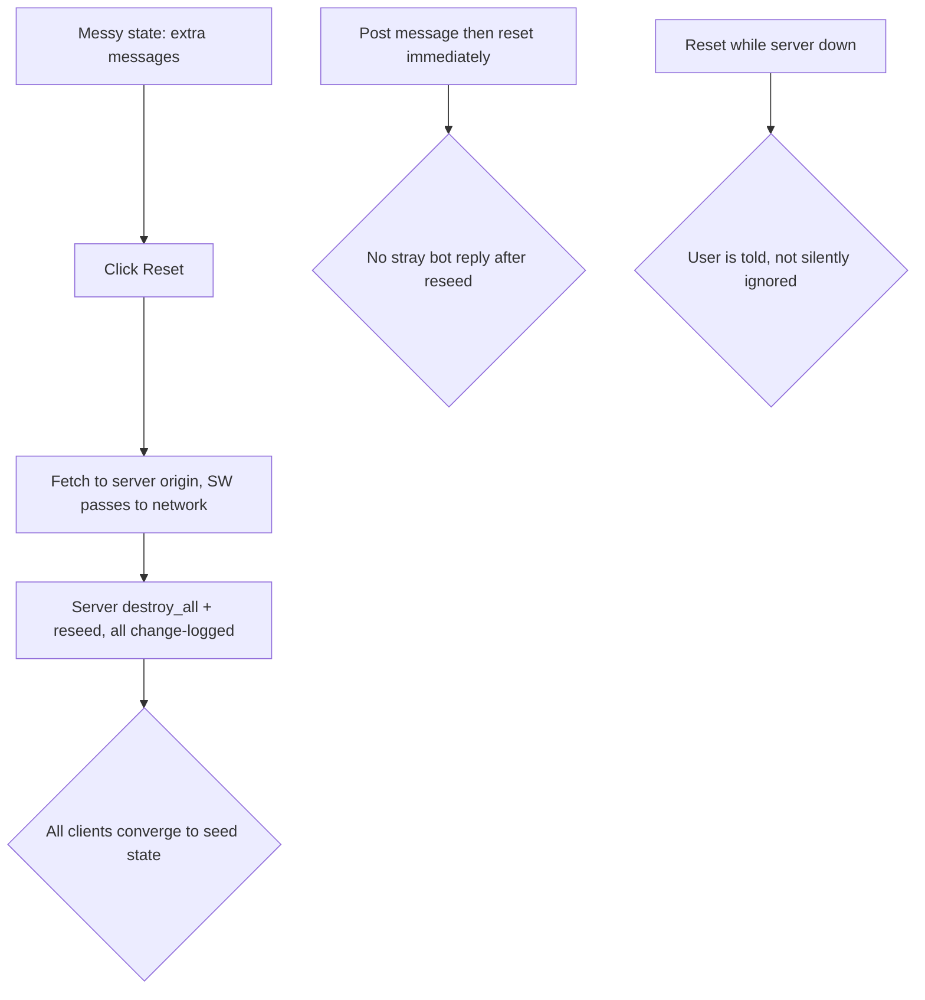

# Dogfood Report — feat/swiss-slack-demo

> Diff-scoped browser QA of `feat/swiss-slack-demo` vs the trunk. Generated by `/ce-dogfood` on 2026-07-22. Tested in the real browser runtime (ruby.wasm + PGlite + service worker via Vite :5173, Rails sync server :3000), driven by `agent-browser`.

## Diff Summary

- Demo app restructured into a gallery: root index at `/` (home), todo demo moved under `/todo`, new Swiss Slack demo under `/slack`; shared Swiss stylesheets replace inline `<style>`.
- New Slack demo: `ChatUser`/`Channel`/`Message` syncable models, idempotent seeds, channels + DMs UI, composer, seeded fake users.
- Fake replies: `server_only after_create_commit` on `Message` enqueues `Slack::FakeReplyJob` (ActiveJob `:async`, 1–3 s wait); the reply is a server write.
- Gem change: server-originated `Syncable` writes now bump `server_version` and log `instant_record_changes` rows, so server writes stream to browsers over the existing SSE endpoint.
- Reset endpoint (`POST /slack/reset`, API-style, CORS) wipes and reseeds server-side with change-logged destroys; service worker passes `?instant_record_network=1` requests to the network.

## Personas

Source: inferred (no STRATEGY.md/VISION.md/persona docs in repo).

- **Library evaluator** — a Rails dev deciding whether InstantRecord is real; cares that the demos boot, sync visibly works, offline doesn't lie, and the code reads like normal Rails.
- **Demo presenter** — shows the SSE/offline trick live (two browsers, airplane mode); cares that convergence is fast, reset recovers any messy state, and nothing needs explaining.

## Flows Tested

### F1 — Gallery entry

### F2 — Todo demo (regression of moved code)

### F3 — Slack message + fake reply over SSE

### F4 — Multi-client convergence ("opening should update all")

### F5 — Offline compose → resync

### F6 — Reset convergence and races

## Test Matrix & Results

| # | Flow | Journey / Scenario | Status | Issue | Fix | Commit |
|---|------|--------------------|--------|-------|-----|--------|
| 1 | F1 | Server runtime sanity: /home, /todo, /slack render; reset 204 | Pass | | | |
| 2 | F1 | PWA boots at :5173; root serves home index from browser runtime | Fixed | First boot replayed all seed rows as client mutations; outbox poisoned, sync stuck retrying forever | Seeds are server-only; duplicate-id creates rejected | d814269 |
| 3 | F1 | Gallery cards navigate to /todo and /slack inside PWA | Pass | | | |
| 4 | F2 | PWA todo: create → instant + pending→synced badge | Pass | | | |
| 5 | F2 | PWA todo: "reject me" → server rejects → local rollback | Pass (verified server-side: 1 rejected mutation, 0 rows) | | | |
| 6 | F3 | PWA slack: post in #general → instant render, pending→synced | Pass | | | |
| 7 | F3 | Fake reply appears in same tab without user action | Pass (~4–8 s) | | | |
| 8 | F3 | DM: reply authored by exactly the DM partner | Pass | | | |
| 9 | F4 | Second client sees A's message + bot reply via SSE, no interaction | Pass (~10–15 s worst case) | | | |
| 10 | F4 | Cold-open second client catches up to full state from cursor 0 | Pass | | | |
| 11 | F5 | Offline: post → pending badge; navigate channels offline | Pass | | | |
| 12 | F5 | Reconnect: message syncs, badge updates, reply arrives | Pass | | | |
| 13 | F6 | Reset from one client → all clients converge to seed state | Pass | | | |
| 14 | F6 | Break-it: post then reset immediately (job/reset race) | Pass (server ends at exactly the 7 seed messages) | | | |
| 15 | F2/F3 | Edge: whitespace-only body, unicode, 400+ char unbroken word | Fixed | Long unbroken words widened the page to ~6000px | `overflow-wrap: anywhere` on message bodies + todo titles | b34274c |
| 16 | all | PWA renders styled at all | Fixed | **Browser runtime served empty CSS/images** — `wasm.rb` inherits production, which expects precompiled `public/assets` that are never packed | `config.assets.server = true` in wasm env | b34274c |
| 17 | all | Console/page errors clean across the run | Fixed | /icon.png + /favicon.ico 404ed on every page load in the PWA | Asset-pipeline icons; favicon + SW passthrough | 034cd1c, d41e64f |
| 18 | F6 | Break-it: reset while the sync server is down | Fixed | Silent no-op (fetch rejected, nothing shown) | Alert on failed reset fetch | d41e64f |

## What Was Fixed

### Browser runtime replayed seed data at the server, poisoning the outbox — `d814269`
- **Symptom:** Fresh PWA boot showed 19 stuck pending mutations and endless failing `POST /instant_record/mutations` (each retry 500ing); todo list stayed empty.
- **Root cause:** The service worker's `DatabaseTasks.prepare_all` runs `db/seeds.rb` in the browser too. In the browser every seeded row is a local write → outbox mutation → replayed at the server, whose rows already exist (duplicate PKs). The applier raised `RecordNotUnique` (500), so the client retried the poisoned batch forever.
- **Fix:** `demo/db/seeds.rb` runs only `unless InstantRecord.browser?` (browsers get seed data via the downstream change-log sync). Gem-side, `MutationApplier` now rejects duplicate-id creates so a replaying client rolls back and converges instead of retrying forever.
- **Regression tests:** `demo/test/models/seeds_runtime_test.rb` (seeds skipped in browser runtime, applied on server); `test/syncable_test.rb` duplicate-id rejection test.

### Browser runtime was completely unstyled (empty CSS and images) — `b34274c`
- **Symptom:** Every PWA page rendered as bare unstyled HTML; digested asset URLs returned empty 200s (`len=0`); this also masqueraded as "stale bundle" during diagnosis.
- **Root cause:** `config/environments/wasm.rb` inherits `production.rb`, which assumes precompiled assets in `public/assets` — but `public/` is never packed into the wasm bundle. This branch's R12 move from inline `<style>` to Propshaft stylesheets made the demo depend on asset serving inside the VM for the first time.
- **Fix:** `config.assets.server = true` in the wasm environment — Propshaft serves dynamically from the packed `app/assets`.
- **Regression test:** none meaningful in the server-side suite (the failure only exists inside the wasm runtime); verified by browser replay — fresh PWA boot renders the Swiss layout, computed styles confirmed.

### Long unbroken words blew the layout out to ~6000px — `b34274c`
- **Symptom:** A 400-char unbroken message widened `body` to 5817–6183px (horizontal scroll).
- **Fix:** `overflow-wrap: anywhere` on `.demo-slack ol.messages .body` and `.demo-todo .title`.
- **Regression test:** pure CSS; verified by browser replay (posted a 400-char word; `scrollWidth` stays at viewport width).

### Stale `app.wasm` could be served to a reinstalled service worker — `b34274c`
- **Symptom:** After a rebuild, clients could compile a cached bundle.
- **Fix:** SW template pre-compiles the module from `fetch("/app.wasm", { cache: "no-cache" })` so the bundle is revalidated (304 when unchanged).
- **Regression test:** none meaningful server-side; behavior verified during the session.

### Icon/favicon 404s on every PWA page load — `034cd1c`, `d41e64f`
- **Symptom:** 3–4 console 404s per page load (`/icon.png`, `/icon.svg`, `/favicon.ico`) — `public/` isn't packed into the wasm.
- **Fix:** icons moved to `app/assets/images` and referenced via `asset_path`; favicon shipped in `pwa/public/` with an SW network passthrough.
- **Regression test:** pure asset wiring; verified by browser replay (console clean on fresh boot).

### Reset while the sync server is down was a silent no-op — `d41e64f`
- **Symptom:** Clicking Reset with the server unreachable did nothing (fetch rejection swallowed).
- **Fix:** the reset handler alerts when the fetch fails or returns non-OK.
- **Regression test:** trivial inline JS; verified by browser replay during the offline scenario.

## Paper Cuts (by persona)

- **Demo presenter** — message timestamps render in UTC (`created_at.strftime("%H:%M")`), which reads wrong in a live demo — medium — deferred.
- **Demo presenter** — cross-client convergence latency is ~10–15 s worst case (3 s tick + SSE window + full-page reload); fine for a demo, but "watch it appear" moments need patience — low — deferred (reload-free updates already listed as follow-up work in the plan).
- **Library evaluator** — all visitors share one "you" identity, so two open browsers both say "You" for each other's messages; intentional per scope (no auth), but one line of copy in the UI would pre-empt confusion — low — deferred.
- **Library evaluator** — first boot downloads/compiles a ~62 MB wasm with only the splash's one-line status; expected for the PoC — low — deferred.

## Console Errors

After fixes: clean on fresh boot (one benign Vite HMR debug line). Before fixes: recurring 404s (icons/favicon) and repeated failed mutation POSTs (seed replay bug) — both resolved above.

## Human Verifications

Not applicable — no OAuth/email/payments in the demos.

## Decisions for a Human

### ~~Installed clients have no update story for new bundles~~ — resolved in `56b5c09`
- **What was broken:** An already-installed PWA kept its booted VM until the service worker was replaced; long-lived clients ran old bundles indefinitely (this bit the branch author within the hour: stuck pending mutations and a blank /slack from a pre-branch bundle).
- **Resolution (option a):** `instant_record:build` stamps the `app.wasm` digest into `rails.sw.js`; every rebuild changes the worker's bytes, the browser installs the update on the next navigation, and the new worker claims open tabs and posts `sw_updated` so they reload onto the new bundle. Verified live.

### Fresh clients depend on a complete change log
- **What's broken (potentially):** A fresh browser converges by replaying `instant_record_changes` from cursor 0. If the change log is ever pruned, or rows predate server-side change logging, fresh clients silently miss data.
- **Why escalated:** Needs a snapshot/bootstrap design (initial state download) — a sync-protocol decision.
- **Options:** (a) document "never prune the change log" for the PoC; (b) add a bootstrap endpoint that serves current state + cursor.
- **Recommendation:** (a) now, (b) when data volume makes replay slow.

## Learnings

- **Anything that runs on boot runs in both runtimes.** `db/seeds.rb`, initializers, and callbacks all execute inside the browser VM too; every server-ism needs a `browser?` guard or a `server_only` block. The seed-replay bug is the canonical trap.
- **`public/` does not exist in the browser runtime.** Only `app lib config db` are packed (wasmify.yml); anything referenced from `public/` (assets, favicons) 404s in the PWA. Serve through the asset pipeline or the PWA's static host.
- **The wasm env inherits production.rb** — every production assumption (precompiled assets, far-future caching, SSL) needs re-examination for in-browser use.
- **Verify in the runtime you shipped for.** All server-side tests were green while the PWA was completely unstyled and poisoning its outbox on first boot — the browser runtime is the product here and needs its own smoke pass after every change (`instant_record:build` + fresh profile).

## Final Status

**Ready, with the two escalations above tracked as follow-ups.** All 18 matrix scenarios pass (6 required fixes, all committed on this branch: `d814269`, `034cd1c`, `b34274c`, `d41e64f`). Break-it scenarios held after fixes: offline compose/resync (server killed and restarted mid-session), cold-client catch-up, live cross-client SSE convergence, post-then-reset race, whitespace/unicode/long-word input, reset-while-offline. Automated suites at finish: gem `bundle exec rake test` 46 runs / 0 failures, demo `bin/rails test` 43 runs / 0 failures.
