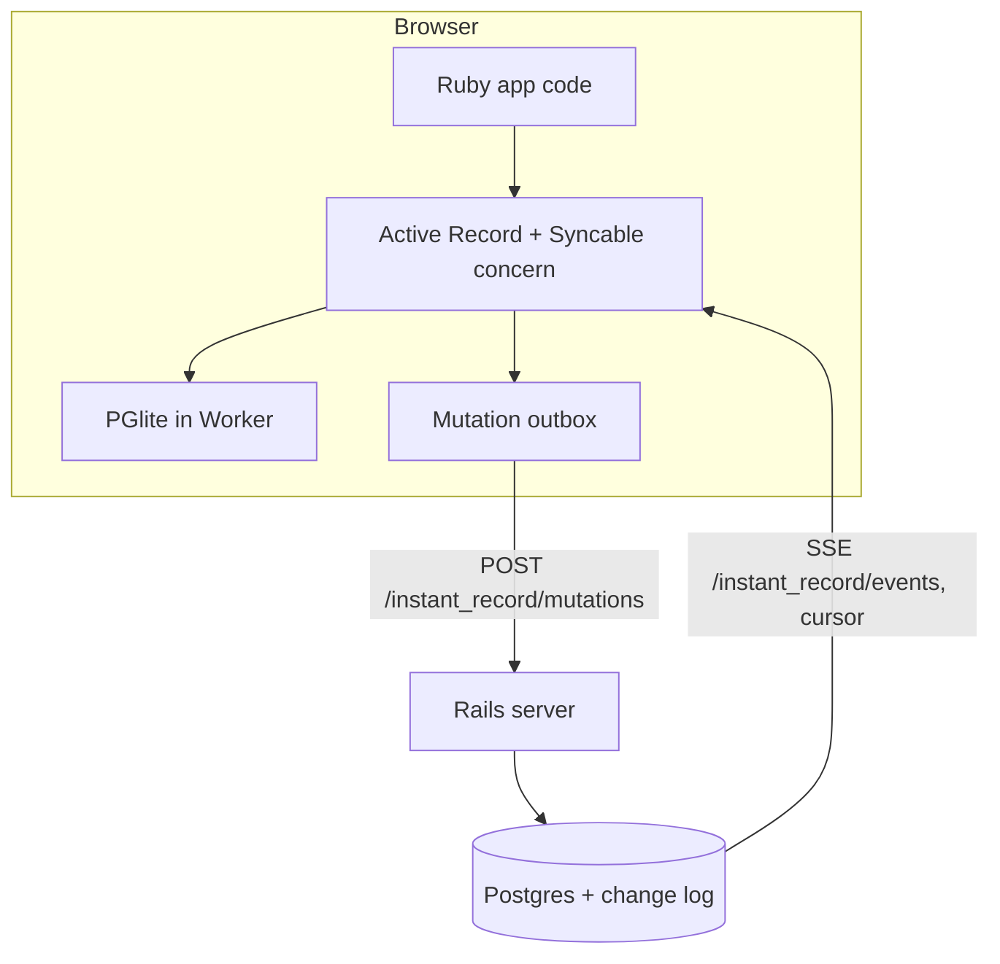
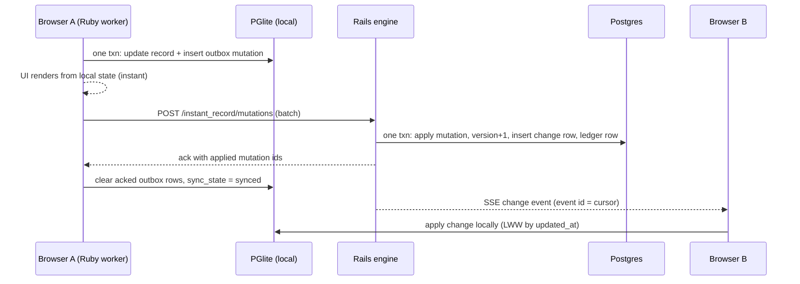
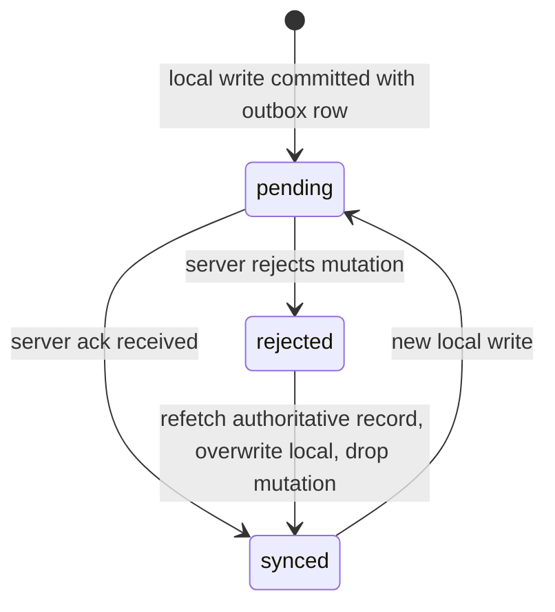

# InstantRecord Spike - Plan

## Goal Capsule

- **Objective:** Prove that Rails models can run in the browser as a local-first, offline-capable, optimistically-synced application layer — real Active Record under ruby.wasm, PGlite locally, Rails + Postgres authoritative, HTTP POST up and SSE down — packaged as a real gem with a demo app.
- **Product authority:** The Product Contract below, plus `README.md` (the target developer experience).
- **Execution profile:** Spike with go/no-go gates. U2 is the boot kill-gate — if it fails, stop and report rather than continuing to sync work. Chrome is the target browser; Safari is out of scope.
- **Open blockers:** None.

---

## Product Contract

*Product Contract preservation: unchanged, with two clarifications — the two Outstanding Questions previously deferred to planning are resolved in Planning Contract KTD4 and KTD5, and Dependencies / Assumptions is updated with version pins found during research.*

### Summary

A spike named InstantRecord: the same `ApplicationRecord` model classes run in the browser (ruby.wasm + wasmify-rails, PGlite) and on a Rails server (CRuby, Postgres), with a `Syncable` concern providing optimistic local writes, a durable mutation outbox, HTTP mutation upload, and an SSE change stream with a resumable cursor.

### Problem Frame

Local-first sync engines (Linear-style) make apps instant and offline-capable, but they are a JavaScript-ecosystem phenomenon. Ruby now runs in the browser via ruby.wasm, and wasmify-rails already bridges Active Record to in-browser databases — yet nobody has built the synchronization layer that would let a Rails developer write `Issue.create!` in the browser and have it durably converge with a server. The pieces exist; the sync experience is the unbuilt part. This spike tests whether the combination is viable before committing to a real gem.

### Key Decisions

- **This is a spike, not a product.** Learn first, decide later; DX polish and production hardening are out of scope. (session-settled: user-directed — chosen over building the open-source gem or a maintained demo now: the architecture's viability is unproven.)
- **Real Active Record via wasmify-rails, not a custom model layer.** (session-settled: user-directed — chosen over a lighter ActiveModel-like layer on ruby.wasm: the spike's risk budget goes to sync, not rebuilding querying and validations.)
- **PGlite in the browser.** (session-settled: user-directed — chosen over SQLite Wasm: shared model classes run against one Postgres dialect end-to-end; accepts a larger bundle and PGlite's async-only API, which requires an asyncified ruby.wasm build executed via `evalAsync`. SQLite Wasm via the `sqlite3_wasm` adapter is the named escape hatch.)
- **Shared model classes between browser and server.** The same model file loads in both runtimes. (session-settled: user-directed — chosen over a server-only Rails app or a bare Rack service: it tests the project's central hypothesis and is the riskier, more interesting option.)
- **HTTP POST for mutations, SSE for the change stream.** (session-settled: user-approved — chosen over WebSocket: writes are request/response anyway; EventSource provides reconnect, and the event id doubles as the sync cursor.)
- **Ruby Wasm from day one.** (session-settled: user-approved — chosen over a JavaScript prototype phase: the central hypothesis is whether browser Ruby feels good, so deferring Wasm defers the real unknowns — bundle size, boot time, interop, GC.)
- **Optimistic local-first writes with an atomic outbox.** The record change and its outbox mutation commit in one local transaction, so a crash never loses an unsent write. (session-settled: user-approved.)
- **Last-write-wins by `updated_at` is the only conflict strategy.** The model-level `resolves_conflict_on` DSL is sketched in the README but not built.



### Actors

- A1. **Developer** — writes ordinary Rails models with `include InstantRecord::Syncable`; the target DX in `README.md`.
- A2. **Browser client** — ruby.wasm + Active Record + PGlite in a Web Worker; owns local truth and the outbox.
- A3. **Sync server** — Rails engine over Postgres; authoritative store, mutation endpoint, SSE stream.

### Requirements

**Browser runtime and persistence**

- R1. Real Active Record boots under ruby.wasm in a Web Worker using wasmify-rails' `pglite` adapter. Boot time and bundle size acceptable for interactive use is the spike's first kill-gate; measure it before building sync.
- R2. A model becomes syncable by `include InstantRecord::Syncable` on an ordinary `ApplicationRecord` subclass; the same class file loads unmodified in browser and server.
- R3. Local PGlite data survives a tab reload.

**Optimistic writes and outbox**

- R4. `create!` / `update!` / `destroy!` commit to local PGlite immediately; the UI reads local state and never waits on the network.
- R5. Every local write records an outbox mutation in the same local transaction as the record change.
- R6. The outbox is durable across reload and offline periods, and drains in order on reconnect.

**Sync protocol**

- R7. The client uploads mutation batches via HTTP POST; mutations carry client-generated ids and the server applies them idempotently.
- R8. The server applies each accepted mutation in one Postgres transaction that updates the record, bumps its version, and appends a change-log row.
- R9. Changes stream to all connected clients over one SSE connection; the event id is a cursor, and a reconnecting client resumes from its last cursor instead of refetching everything.
- R10. The server can reject a mutation; the rejecting response causes the client to reconcile to server state without corrupting the local database.
- R11. Concurrent writes to the same row resolve last-write-wins by `updated_at` on both sides.

**Demo**

- R12. A minimal Linear-like issue list exercises the whole loop in two browser windows.

### Acceptance Examples

- AE1. **Instant optimistic write.** **Covers R1, R4, R5.** Given the demo app is booted, when the user creates an issue in browser Ruby, then the UI shows it immediately and the row exists in local PGlite before any network call completes.
- AE2. **Offline durability.** **Covers R3, R6.** Given the browser is offline, when the user creates records and reloads the tab, then the records and their pending mutations are still present, and they sync when the connection returns.
- AE3. **Two-browser sync.** **Covers R7, R8, R9.** Given two browser windows on the same server, when window A changes an issue, then window B reflects the change via SSE without a refresh.
- AE4. **Server rejection.** **Covers R10.** Given the server refuses a mutation, when the rejection reaches the client, then the local record returns to a consistent server-derived state and the outbox does not retry the rejected mutation forever.

### Scope Boundaries

- CRDTs and operational transforms — last-write-wins only.
- Postgres logical replication — sync is application-level over HTTP and SSE.
- Multi-tab leader election — one tab owns the database.
- Attachments and large blobs.
- Authentication and authorization on the sync endpoint.
- The `resolves_conflict_on` merge DSL — sketched in the README, not built.

### Dependencies / Assumptions

- wasmify-rails provides working `pglite` and `sqlite3_wasm` Active Record adapters and the build tooling for packaging Rails apps to Wasm (verified against the project README and Evil Martians' writeups).
- PGlite exposes only an async API, so browser Ruby must run an asyncified ruby.wasm build via `evalAsync`; the asyncify stack-size issue (ruby.wasm #555) may require the known heap-buffer patch. This risk is absorbed into the R1 kill-gate.
- Ruby 3.3.3 is the known-good version for wasmify-rails builds; Ruby 3.4 currently fails on gem deprecation warnings, and `bigdecimal` needs the documented `ignore_gem_extensions` workaround.
- Rails 8.1 + PGlite needs a small monkey-patch adding `ntuples` to `PGlite::Result`.
- If the PGlite path fails the kill-gate, the escape hatch is SQLite Wasm (`sqlite3_wasm` adapter), reintroducing a two-dialect risk for the shared models.

### Sources / Research

- wasmify-rails: https://github.com/palkan/wasmify-rails — `pglite` and `sqlite3_wasm` adapters, build tooling, known issues (Ruby 3.4, `bigdecimal`).
- Prior art: palkan/rails-on-wasm-playground PR #7 — working Rails + PGlite demo, including the asyncify patch requirement.
- Evil Martians, "Ruby on Rails on WebAssembly": https://evilmartians.com/chronicles/ruby-on-rails-on-webassembly-a-guide-to-full-stack-in-browser-action
- Active Record on Wasm chapter (adapter setup, `evalAsync` requirement for PGlite): https://writebook-on-wasm.fly.dev/5/ruby-on-rails-on-webassembly/57/active-record-on-wasm
- PGlite docs: https://pglite.dev — filesystems (IndexedDB recommended over OPFS AHP; OPFS is dedicated-worker-only and fails on Safari), multi-tab worker, `relaxedDurability`.
- ruby.wasm: https://github.com/ruby/ruby.wasm

---

## Planning Contract

### Key Technical Decisions

- KTD1. **Real gem plus demo app from the start.** The repo root is the `instant_record` gem with a mounted `InstantRecord::Engine`; a `demo/` Rails app consumes the gem by path, defines the shared demo models, and is the Postgres-backed sync server. (session-settled: user-directed — chosen over building inside a demo app and extracting a gem later: kills the extraction migration entirely; wasmify-rails builds from the demo app's Gemfile either way.)
- KTD2. **Pin Ruby 3.3.3 for the Wasm build.** Ruby 3.4 fails on upstream gem deprecation warnings under wasmify-rails; apply the `bigdecimal` `ignore_gem_extensions` workaround and expect the asyncify stack-size patch (ruby.wasm #555) if boot crashes.
- KTD3. **PGlite persists via IndexedDB (`idb://`) with `relaxedDurability`, not OPFS.** PGlite's docs recommend IndexedDB in the browser; the OPFS AHP filesystem is dedicated-worker-only and fails on Safari. R3 (survives reload) holds either way. Revisit OPFS only if IndexedDB flush latency hurts the demo.
- KTD4. **Reconciliation is direct overwrite with a `sync_state` column.** Optimistic writes update the local row directly; on server rejection the client refetches the authoritative record, overwrites local state, and drops the rejected mutation from the outbox. The server-snapshot-plus-pending-overlay model is the documented upgrade path, not built. (session-settled: user-approved — proposed with the overlay alternative surfaced; confirmed at scoping.)
- KTD5. **One dedicated Web Worker hosts both ruby.wasm and the PGlite instance.** The PGlite JS object lives in the worker's JS context and is bridged through wasmify-rails' registered interface; Ruby executes via `evalAsync`. A separate PGlite worker (or PGliteWorker multi-tab leader election) is out of scope — one tab owns the database.
- KTD6. **Engine endpoints: `POST <mount>/mutations` and `GET <mount>/events`.** SSE is served with `ActionController::Live`; the change-log row id is the SSE event id, and the client resumes with `Last-Event-ID` or `?after=<cursor>`.
- KTD7. **Idempotency via client-generated mutation UUIDs.** The server keeps an applied-mutations ledger with a unique index on mutation id; replays return the original result without re-applying (implements R7).
- KTD8. **Last-write-wins by `updated_at` on both sides** (inherits the Product Contract Key Decision; applies at mutation-apply time on the server and at change-apply time on the client).

### High-Level Technical Design

Mutation round-trip:



Per-record sync lifecycle:



### Output Structure

```text
instant_record/
├── instant_record.gemspec
├── Gemfile
├── Rakefile
├── README.md
├── CHANGELOG.md
├── lib/
│   ├── instant_record.rb
│   ├── instant_record/
│   │   ├── version.rb
│   │   ├── engine.rb
│   │   ├── syncable.rb           # shared concern (both runtimes)
│   │   └── client/               # browser-side, runs under ruby.wasm
│   │       ├── configuration.rb
│   │       ├── outbox.rb
│   │       └── sync.rb
│   └── tasks/instant_record.rake # instant_record:build
├── app/
│   ├── controllers/instant_record/
│   │   ├── mutations_controller.rb
│   │   └── events_controller.rb
│   └── models/instant_record/
│       ├── change.rb             # server change log
│       └── applied_mutation.rb   # idempotency ledger
├── config/routes.rb
├── test/
└── demo/                         # Rails app: sync server + shared models + wasm build source
    ├── app/models/issue.rb
    ├── app/javascript/instant_record/worker.js
    ├── config/database.yml       # wasm env: pglite adapter
    └── wasmify.yml
```

The tree is a scope declaration; the implementer may adjust layout if the wasmify-rails build dictates a different shape.

---

## Implementation Units

### U1. Gem skeleton and engine scaffold

- **Goal:** A loadable `instant_record` gem with `InstantRecord::Engine`, version, test harness, and empty module structure matching the Output Structure.
- **Requirements:** Enables all; implements KTD1.
- **Dependencies:** None.
- **Files:** `instant_record.gemspec`, `Gemfile`, `Rakefile`, `lib/instant_record.rb`, `lib/instant_record/version.rb`, `lib/instant_record/engine.rb`, `config/routes.rb`, `test/test_helper.rb`, `test/instant_record_test.rb`.
- **Approach:** Standard Rails engine gem (isolated namespace). Runtime dependency on `rails` (the version wasmify-rails supports) and `wasmify-rails`. Minitest.
- **Test scenarios:** Gem loads (`require "instant_record"` defines `InstantRecord::VERSION` and `InstantRecord::Engine`); engine routes draw without error.
- **Verification:** `bundle exec rake test` green at repo root.

### U2. Demo app and browser boot kill-gate

- **Goal:** A `demo/` Rails app that boots real Active Record under ruby.wasm in a Web Worker against PGlite, with boot time and bundle size measured. This is the go/no-go gate for the whole spike.
- **Requirements:** R1, R3 (partially); KTD2, KTD3, KTD5. Covers AE1's boot precondition.
- **Dependencies:** U1.
- **Files:** `demo/` (new Rails app, Postgres for dev/server), `demo/Gemfile` (path-sources the gem), `demo/config/database.yml` (`wasm:` env with `pglite` adapter), `demo/wasmify.yml`, `demo/app/javascript/instant_record/worker.js`, `lib/tasks/instant_record.rake` (`instant_record:build`).
- **Approach:** Follow the wasmify-rails install flow and the rails-on-wasm-playground PGlite demo. Ruby 3.3.3, asyncified build, `bigdecimal` workaround, `ntuples` monkey-patch for Rails 8.1 + PGlite if needed. Worker JS creates the PGlite instance with `idb://` storage and `relaxedDurability`, registers the interface, and boots the Rails VM with `evalAsync`. Skip Action Controller/routing in the browser bundle where wasmify-rails allows — models and the InstantRecord client are what must boot.
- **Execution note:** This is packaging/config; prefer runtime smoke verification over unit coverage. Record cold and warm boot milliseconds and bundle megabytes; stop and report if boot is unusable (guardrail targets: warm boot under ~5s, cold under ~15s, on desktop Chrome — actuals are the deliverable, the user makes the go/no-go call).
- **Test scenarios:** `Test expectation: none — packaging/config unit; verification is the smoke check below.`
- **Verification:** In Chrome, the demo page boots the worker, `Issue.count` evaluates via `evalAsync`, a created row survives a tab reload (R3), and boot/bundle metrics are recorded in the PR description.

### U3. Syncable concern, sync columns, and atomic outbox

- **Goal:** `include InstantRecord::Syncable` gives a model UUID primary keys stable across both runtimes, a `sync_state`, and browser-side write interception that records an outbox mutation in the same local transaction as every write.
- **Requirements:** R2, R4, R5, R6 (durability half); KTD4.
- **Dependencies:** U2.
- **Files:** `lib/instant_record/syncable.rb`, `lib/instant_record/client/outbox.rb`, `lib/instant_record/client/configuration.rb`, demo migrations in `demo/db/migrate/` (issues table with `server_version`, `sync_state`; `instant_record_outbox` table), `test/syncable_test.rb`.
- **Approach:** UUID ids generated client-side. On the browser runtime only (detect via wasmify/platform check), wrap `create!`/`update!`/`destroy!` commits so the outbox row (mutation UUID, record type/id, operation, changes, base version) inserts inside the same transaction — `after_*_commit` callbacks alone are insufficient for atomicity. On the server runtime the concern is inert except shared column conventions.
- **Execution note:** Implement the atomicity contract test-first — the write and its outbox row must commit or roll back together.
- **Test scenarios:** Happy path: `create!` inserts record + one outbox row atomically; `update!` captures changed attributes and base version; `destroy!` records a destroy mutation. Edge: rollback inside the transaction leaves neither row; two writes to one record produce two ordered outbox rows. (Concern logic tests run under CRuby in the gem test suite; browser integration is proven in U7's walkthrough.)
- **Verification:** Gem tests green; in the demo browser, a write appears in local PGlite plus outbox, and both survive reload (AE2's local half).

### U4. Server mutation endpoint with idempotent apply and change log

- **Goal:** `POST /instant_record/mutations` accepts batches, applies each in one Postgres transaction (record update, version bump, change-log row, ledger row), idempotently, with last-write-wins and per-mutation accept/reject results.
- **Requirements:** R7, R8, R10 (server half), R11; KTD6, KTD7, KTD8.
- **Dependencies:** U1; testable against `demo/` from U2.
- **Files:** `app/controllers/instant_record/mutations_controller.rb`, `app/models/instant_record/change.rb`, `app/models/instant_record/applied_mutation.rb`, engine migrations (changes + applied_mutations tables, unique index on mutation id), `InstantRecord.sync` registration in `lib/instant_record.rb`, demo mount in `demo/config/routes.rb`, `test/controllers/mutations_controller_test.rb`.
- **Approach:** Registered-models allowlist via `InstantRecord.sync Issue, ...`. Each mutation applies in a transaction; validation failure or unregistered model yields a per-mutation `rejected` result with reason. LWW: an incoming update older by `updated_at` than the stored row is acknowledged but skipped.
- **Test scenarios:** Happy path: valid create/update/destroy mutations apply, bump version, append change rows, return `applied`. Idempotency: replaying the same mutation UUID returns the original result and applies nothing (Covers AE3's "duplicate mutation" concern). Rejection: validation-failing mutation returns `rejected` with reason and writes no change row (Covers AE4 server half). LWW: older-`updated_at` update is skipped, newer wins (R11). Error path: batch with one bad mutation still applies the good ones. Integration: applying a mutation creates exactly one change row inside the same transaction.
- **Verification:** Engine controller tests green against the demo app's Postgres.

### U5. SSE change stream with cursor, and the browser sync client

- **Goal:** `GET /instant_record/events` streams change rows as SSE with the change id as event id; the browser client drains the outbox via POST, applies incoming changes to local PGlite, and resumes from its cursor after disconnect.
- **Requirements:** R6 (drain half), R9; KTD6.
- **Dependencies:** U3, U4.
- **Files:** `app/controllers/instant_record/events_controller.rb`, `lib/instant_record/client/sync.rb` (`InstantRecord.configure/start/sync/pending_count`), SSE wiring in `demo/app/javascript/instant_record/worker.js` (EventSource on the main thread or worker, forwarding events into the Ruby worker), `test/controllers/events_controller_test.rb`.
- **Approach:** `ActionController::Live`, catch-up query from `?after=<cursor>` or `Last-Event-ID`, then live tail (dev-grade polling or Postgres LISTEN/NOTIFY — implementer's choice, noted as dev-only). Client stores its cursor in local PGlite; applies changes LWW; acked outbox rows clear per U4 results.
- **Test scenarios:** Happy path: connecting with `?after=N` receives exactly the changes after N in order, event id equals change id. Edge: no new changes holds the connection open without events; reconnect with the last-seen id misses nothing and duplicates nothing. Client (gem-level unit): applying a change updates the local row and advances the cursor; an incoming change older by `updated_at` than a local pending write does not clobber it (R11 client side).
- **Verification:** Controller tests green; manual: two curl/browser sessions see the same ordered stream.

### U6. Rejection reconcile on the client

- **Goal:** A rejected mutation drops from the outbox, the client refetches the authoritative record, overwrites local state, and marks it `synced` — no corruption, no infinite retry.
- **Requirements:** R10; KTD4.
- **Dependencies:** U4, U5.
- **Files:** `lib/instant_record/client/sync.rb` (reconcile path), `lib/instant_record/client/outbox.rb` (drop/dead-letter), a demo rejection hook in `demo/app/models/issue.rb` (e.g., server-side validation the browser model lacks, to trigger AE4), `test/reconcile_test.rb`.
- **Approach:** Per KTD4: on a `rejected` result, delete the mutation from the outbox, fetch the record's server state (piggybacked in the rejection response to avoid a second round trip), overwrite the local row, set `sync_state`.
- **Test scenarios:** Covers AE4. Happy path: rejection response overwrites the local row with server state and empties that mutation from the outbox. Edge: rejection for a record with a second still-pending mutation keeps the later mutation queued; rejection of a create (no server state) deletes the local row. Error path: refetch failure leaves the record marked `rejected` rather than looping.
- **Verification:** Gem tests green; manual AE4 walkthrough in the demo.

### U7. Demo issue list and the four-demo walkthrough

- **Goal:** A minimal Linear-like issue list UI in the demo app that makes AE1–AE4 demonstrable in two Chrome windows, with the walkthrough scripted in the README.
- **Requirements:** R12; AE1, AE2, AE3, AE4.
- **Dependencies:** U3, U4, U5, U6.
- **Files:** demo views/JS for the issue list (`demo/app/views/`, `demo/app/javascript/`), README "Demo" section update.
- **Approach:** Renders from local PGlite via the Ruby worker; create/toggle issues; a visible pending-count badge (`InstantRecord.pending_count`) makes optimism and drain observable. Offline is simulated with DevTools.
- **Test scenarios:** `Test expectation: none — UI wiring over tested layers; the deliverable is the manual AE walkthrough below.`
- **Verification:** All four Acceptance Examples pass by hand: AE1 instant create; AE2 offline + reload + reconnect drain; AE3 two-window SSE propagation; AE4 rejection reconcile. Walkthrough steps land in the README.

---

## Verification Contract

| Gate | Check | Applies to |
|---|---|---|
| Gem tests | `bundle exec rake test` at repo root | U1, U3, U4, U5, U6 |
| Demo app tests | `bin/rails test` inside `demo/` | U4, U5 |
| Boot kill-gate | Manual: demo boots in Chrome; record cold/warm boot ms and bundle MB; user go/no-go against ~5s warm / ~15s cold guardrails | U2 |
| AE walkthrough | Manual two-window demo: AE1–AE4 in order | U7 |

---

## Definition of Done

- All four Acceptance Examples demonstrable in two Chrome windows following the README walkthrough.
- Gem and demo test suites green.
- Boot and bundle metrics recorded (kill-gate outcome documented even if the answer is "no-go").
- README matches the actually-shipped API; deviations updated rather than left aspirational.
- No abandoned experimental code from dead-end approaches left in the tree.

---

## Risks & Dependencies

- **Asyncify fragility** — `evalAsync` on an asyncified CRuby is the touchiest known path (stack-size crashes, printf-style pitfalls). Mitigation: Ruby 3.3.3 pin, known heap-buffer patch, kill-gate first.
- **Bundle size / boot time** — full Active Record + PGlite + ruby.wasm may simply be too heavy. Mitigation: U2 measures before any sync work is spent; SQLite Wasm escape hatch documented.
- **SSE under dev Puma** — `ActionController::Live` holds a thread per stream; fine for a two-window demo, flagged for anything more.
- **IndexedDB relaxed durability** — a hard crash can lose the last few milliseconds of flush; acceptable for a spike, noted for later.
- **wasmify-rails churn** — young project; pin the version that works and record it in the Gemfile.

## Scope Boundaries

### Deferred to Follow-Up Work

- Gem release, CI, and RubyGems publishing.
- Multi-tab support via PGliteWorker leader election.
- Snapshot-plus-overlay reconciliation (upgrade path from KTD4).
- The `resolves_conflict_on` conflict DSL.
- Production SSE delivery (LISTEN/NOTIFY hardening or a streaming server).
