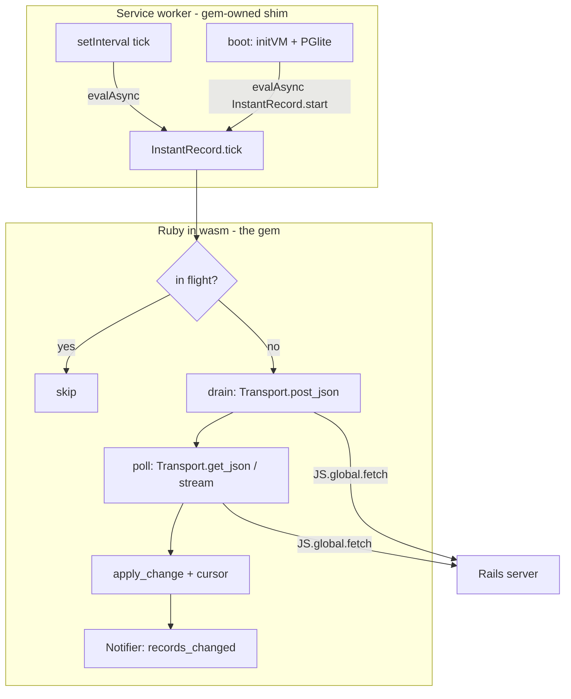

# Ruby-Facing Sync API - Plan

## Goal Capsule

- **Objective:** Replace the service worker's hand-written sync loop with a Ruby API — `InstantRecord.configure` + `InstantRecord.start` — so sync semantics *and* transport read as Ruby, and the JS that remains is an invisible shim the gem ships.
- **Product authority:** `README.md` Roadmap ("A Ruby-facing sync API instead of the JS-driven loop") and the Product Contract below.
- **Execution profile:** Builds on the proven PoC (plan 001). U2 is the interop kill-gate — if Ruby-owned fetch via `JS.global` is unstable under asyncify, stop and report before converting anything else.
- **Open blockers:** None.

---

## Product Contract

### Summary

`InstantRecord.configure { |c| c.endpoint = ... }` and `InstantRecord.start` become the entire browser-side sync surface. Ruby owns the drain, the change-stream consumption, the reconnect/cursor logic, and the re-entrancy guards; the service worker template shrinks to boot plumbing that calls `InstantRecord.start`.

### Problem Frame

The PoC's sync loop lives in `demo/pwa/rails.sw.js`: ~100 lines of JavaScript that fetch, parse SSE, and call into Ruby via `evalAsync`. It works, but it splits the developer story — the README says "you don't write sync code," yet the sync code that exists is user-visible JavaScript in *their* `pwa/` directory, where they can (and will) edit it. Moving the loop behind a Ruby API puts all behavior in one language, makes the PWA shell disposable boilerplate, and turns the sync loop into gem-versioned code that upgrades with `bundle update`.

### Key Decisions

- **Ruby owns semantics and transport; JS keeps only the scheduler.** wasm Ruby cannot sleep without blocking the VM, so ticks come from a gem-owned `setInterval` shim that calls one Ruby entrypoint. This is a hiding move, not a rewrite of physics. (session-settled: user-approved — the trade-off that "Ruby-facing" still needs a thin JS shim underneath was surfaced; user chose the clearer API.)
- **Network calls move into Ruby via `JS.global.fetch(...).await`.** Transport code (`POST /mutations`, change-stream GET) is written in Ruby using the `js` gem's promise interop, replacing the JS `drainOutbox`/`pollChanges` functions.
- **Change stream degrades gracefully from streaming to polling.** If fetch-streaming (`ReadableStream` reader) via interop proves fragile under asyncify, fall back to non-streaming `GET /events?after=<cursor>` JSON polling — the server already closes bounded SSE windows, so semantics are identical at PoC scale. The transport choice is an implementation detail behind the same Ruby API.
- **Single-flight guards move into Ruby state.** The PoC's `draining`/`ssePolling` JS booleans become Ruby-side guards; the JS tick is fire-and-forget and re-entrancy-safe because Ruby refuses overlapping runs.
- **The public surface is exactly:** `InstantRecord.configure` (endpoint, sync_interval), `InstantRecord.start`, `InstantRecord.sync_now` (one manual drain+poll), plus the existing `pending_count`. Everything else is private.

### Requirements

- R1. `InstantRecord.configure { |c| ... }` sets `endpoint` (default: same-origin `/instant_record`) and `sync_interval` (default 3s); callable in both runtimes, inert on the server.
- R2. `InstantRecord.start` (browser only) begins background sync: outbox drains and change-stream catch-up run on the configured interval and immediately after every local write.
- R3. All fetches originate from Ruby; the service worker template contains no sync logic — only VM boot, PGlite setup, request routing, and one `InstantRecord.start` call.
- R4. Overlapping ticks are safe: a tick that arrives while a drain or poll is in flight is skipped, not queued.
- R5. Existing behavior is preserved: ack→synced, rejection→reconcile, LWW both ways, cursor resume, `records_changed` client notification (now emitted from Ruby via interop).
- R6. The PoC demo passes the same live checks after conversion: instant write, two-client SSE propagation, rejection rollback.

### Acceptance Examples

- AE1. **Covers R1, R2, R3.** Given the demo's service worker contains no fetch/SSE code, when the app boots and `InstantRecord.start` runs, then a created issue reaches the server and the badge flips to `synced`.
- AE2. **Covers R4.** Given a drain in flight (slow network), when the next tick fires, then no duplicate POST of the same mutation batch occurs.
- AE3. **Covers R5, R6.** The plan-001 two-client and rejection walkthroughs pass unchanged.

### Scope Boundaries

- No change to the wire protocol, engine endpoints, or server code.
- No multi-tab coordination, no auth (still PoC posture).
- The snapshot+overlay reconciliation and conflict DSL stay deferred (plan 001's list).

### Dependencies / Assumptions

- ruby.wasm's `js` gem supports `JS.global.fetch(...).await` and Ruby-proc-as-JS-callback under the asyncified build wasmify-rails produces (the PoC already exercises `.await` inside the PGlite adapter, so promise interop is proven; proc-callbacks are the U2 verification target).
- The bounded-window SSE design on the server stays as-is; polling-mode fallback relies on it.

---

## Planning Contract

### Key Technical Decisions

- KTD1. **Configuration object, not module ivars:** `InstantRecord::Configuration` with `endpoint`, `sync_interval`; `InstantRecord.config` memoized; `configure` yields it (mirrors wasmify-rails' own shape).
- KTD2. **Transport seam for testability:** Ruby sync logic calls `InstantRecord::Client::Transport` (`post_json(path, payload)`, `get_stream(path) { |event| }` / `get_json(path)`). In wasm it's implemented over `JS.global.fetch`; under CRuby tests it's a swappable double — the drain/apply/reconcile logic gets full unit coverage without a browser.
- KTD3. **One Ruby entrypoint for the scheduler:** `InstantRecord.tick` (drain + poll, guarded). The gem-owned shim registers `setInterval(() => vm.evalAsync("InstantRecord.tick"), interval)` — interval read from Ruby config at `start`.
- KTD4. **`records_changed` emitted from Ruby:** `JS.global[:clients].matchAll.await.forEach { |c| c.postMessage(...) }` behind a `Notifier` seam (same double strategy for tests).
- KTD5. **Streaming first, polling fallback** (see Key Decisions). Decide inside U3 by testing streaming in the real browser; whichever lands, the Ruby API and tests are identical.

### High-Level Technical Design

---

## Implementation Units

### U1. Configuration and start/tick skeleton

- **Goal:** `InstantRecord.configure`, `Configuration` (endpoint, sync_interval), `InstantRecord.start` (browser-only no-op elsewhere), `InstantRecord.tick` with single-flight guard, `InstantRecord.sync_now`.
- **Requirements:** R1, R2 (API half), R4.
- **Files:** `lib/instant_record/configuration.rb`, `lib/instant_record.rb`, `lib/instant_record/client.rb`, `test/configuration_test.rb`, `test/tick_test.rb`.
- **Approach:** Guard state in module ivars; `tick` calls drain then poll through the Transport seam (U2), rescuing and logging per phase so one failure doesn't starve the other.
- **Test scenarios:** Defaults (same-origin endpoint, 3s); configure block overrides; `start` on server runtime is a no-op; overlapping `tick` skips (guard set → second call returns without Transport calls); guard releases after failure.
- **Verification:** Gem tests green.

### U2. Ruby transport over JS fetch — interop kill-gate

- **Goal:** `Transport.post_json` and `Transport.get_json` implemented with `JS.global.fetch(...).await` in wasm; injectable double for CRuby tests. Verified inside the real browser before proceeding.
- **Requirements:** R3 (transport half); KTD2.
- **Dependencies:** U1.
- **Files:** `lib/instant_record/client/transport.rb`, `test/transport_seam_test.rb`, temporary browser smoke in the demo.
- **Approach:** wasm implementation guarded by `InstantRecord.browser?`; JSON in/out as Ruby strings. Browser smoke: evalAsync a `Transport.get_json("/events?after=0")` against the live server and assert parsed events.
- **Execution note:** This is the kill-gate — prove a Ruby-originated fetch round-trip in Chrome (via the demo) before converting the loop. If `.await` on fetch is unstable, stop and report.
- **Test scenarios:** Seam: drain logic issues exactly one `post_json` per batch with correct payload shape; `get_json` parses events and advances cursor; transport errors surface as caught, logged, guard-releasing failures (offline case).
- **Verification:** Gem tests green; browser smoke round-trips against the running server.

### U3. Drain and change-poll in Ruby

- **Goal:** Port `drainOutbox` and `pollChanges` semantics into Ruby (`Client.drain`, `Client.poll_changes`) using Transport; delete nothing JS-side yet.
- **Requirements:** R2, R5; KTD5.
- **Dependencies:** U2.
- **Files:** `lib/instant_record/client.rb`, `test/client_sync_loop_test.rb`.
- **Approach:** Drain: `pending_mutations_json` → `post_json` → `apply_results`. Poll: `get_json`/stream → `apply_change` per event → collect whether anything changed. Try streaming in-browser during this unit; adopt polling fallback if fragile (KTD5).
- **Test scenarios:** Covers AE2. Empty outbox → no POST; applied results clear outbox (existing helpers reused); poll applies events in order and advances cursor; a change application error skips that event without dropping the cursor forward past it; drain failure leaves mutations queued.
- **Verification:** Gem tests green.

### U4. Ruby-emitted client notification

- **Goal:** `records_changed` postMessage moves behind a `Notifier` seam called from Ruby after drains/polls that changed rows.
- **Requirements:** R5; KTD4.
- **Dependencies:** U3.
- **Files:** `lib/instant_record/client/notifier.rb`, `test/notifier_seam_test.rb`.
- **Test scenarios:** Notifier fires once per changed batch, not per event; no notification when nothing changed.
- **Verification:** Gem tests green.

### U5. Shrink the shim: generator template + demo conversion

- **Goal:** `rails.sw.js` (template and demo copy) loses all sync code; boot calls `InstantRecord.start`; the interval shim reads `sync_interval` from Ruby; README moves the API from Roadmap to Usage.
- **Requirements:** R3, R6.
- **Dependencies:** U1–U4.
- **Files:** `lib/generators/instant_record/install/templates/rails.sw.js`, `demo/pwa/rails.sw.js`, `README.md`.
- **Approach:** The shim keeps: PGlite setup, `initRailsVM`, RackHandler routing, `evalAsync("InstantRecord.start")` after boot, and the interval calling `InstantRecord.tick`. Everything else deletes.
- **Test scenarios:** `Test expectation: none — template/plumbing; verification is the live walkthrough below.`
- **Verification:** Covers AE1, AE3. Rebuild (`bin/rails instant_record:build`), then live in Chrome: instant write → synced; two-client propagation; `reject me` rollback. Boot time recorded again to confirm no regression.

---

## Verification Contract

| Gate | Check | Applies to |
|---|---|---|
| Gem tests | `bundle exec rake test` at repo root | U1–U4 |
| Demo tests | `bin/rails test` in `demo/` | regression |
| Interop kill-gate | Browser smoke: Ruby-originated fetch round-trip | U2 |
| Live walkthrough | AE1–AE3 in Chrome, two windows | U5 |

## Definition of Done

- Service worker template contains zero sync logic; `InstantRecord.start` is the only sync API a user sees.
- All AEs pass live; boot time within ~10% of plan-001's baseline.
- Gem + demo suites green; README Usage shows `configure`/`start`, Roadmap entry removed.
- No abandoned JS or dead Ruby seams left behind.

## Risks & Dependencies

- **Asyncify re-entrancy** — a tick entering the VM mid-await is the crash class to watch; mitigated by the Ruby single-flight guard plus the shim's fire-and-forget evalAsync (never two concurrent entries: the guard returns immediately). If evalAsync itself proves non-reentrant at the VM level, serialize ticks in the shim with a promise chain — still invisible to users.
- **Proc-callback interop** — if passing Ruby procs to `setInterval` is flaky, the shim calls `evalAsync("InstantRecord.tick")` by string, which the PoC already proved.
- **Streaming reader fragility** — covered by KTD5's polling fallback; no API change.
