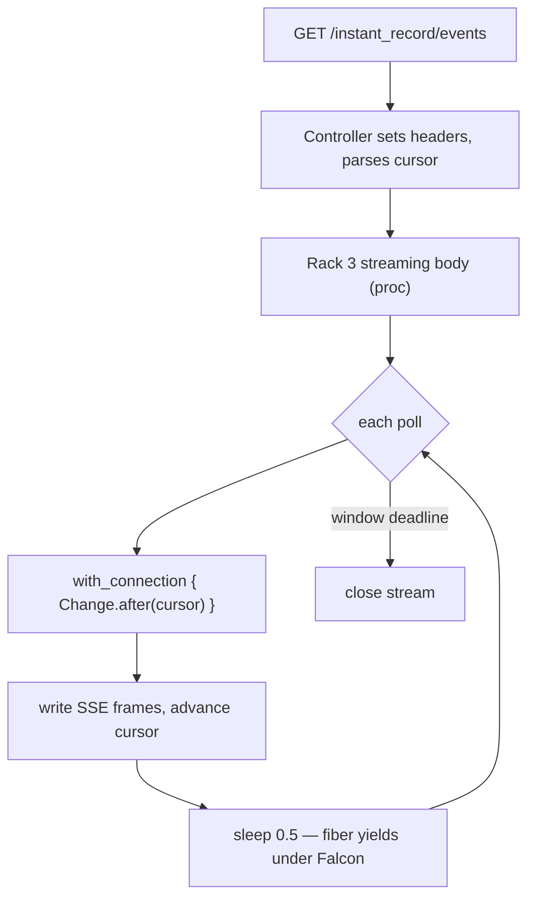

# SSE Rack Streaming and Falcon - Plan

## Goal Capsule

- **Objective:** Make the SSE change stream scale from "a few dozen" to "thousands of idle connections per process": rewrite the events endpoint from `ActionController::Live` to a Rack 3 streaming body, stop pinning a database connection per idle stream, run the demo on Falcon, and prove the ceiling moved with a load spike.
- **Product authority:** The ce-pov verdict (Adopt — scoped) accepted in-session; wire protocol and cursor semantics are unchanged.
- **Execution profile:** U4's load spike is the proof gate — the Falcon recommendation ships only with measured numbers behind it.
- **Open blockers:** None.

---

## Product Contract

### Summary

Same SSE wire protocol (event id = change-log cursor, bounded windows, `Last-Event-ID` resume), delivered by a Rack 3 streaming body that yields to Falcon's fiber scheduler and releases its database connection between polls. Puma remains supported with today's ceiling; Falcon becomes the documented recommendation for SSE-heavy deployments.

### Problem Frame

Every local-first client holds one persistent SSE connection, so concurrent streams scale with open tabs, not requests. The current endpoint holds one thread per stream (`ActionController::Live`; Puma defaults to 3 threads/worker — thread-pool exhaustion with Live is open rails/rails #55762) and, as written, leases a database connection for the whole 25s window. Streams are ~99% `sleep`, which is exactly the workload fibers make nearly free — but `Live` spawns a child thread per request, bypassing the fiber scheduler, so a server swap alone changes nothing. Live + `:fiber` isolation also has a correctness bug fixed in Rails main only in March 2026, after our 8.1.3.

### Requirements

- R1. The events endpoint streams via a Rack 3 streaming body (no `ActionController::Live`), preserving the wire protocol exactly: event id = change id, `?after=`/`Last-Event-ID` cursor resume, bounded window (`INSTANT_RECORD_SSE_WINDOW`, test default 0), CORS header, catch-up-then-tail behavior.
- R2. No database connection is held while a stream sleeps: each poll checks a connection out and releases it (block-scoped checkout).
- R3. The demo runs on Falcon in development, with fiber isolation configured; Puma remains fully supported (documented, tests unchanged).
- R4. A load spike measures both servers: concurrent idle SSE connections held, memory, DB pool usage, and event delivery latency, at N ≥ 200 connections; results are recorded.
- R5. README documents the deployment posture: Falcon recommended for SSE-heavy deployments, Puma fine to start.

### Acceptance Examples

- AE1. **Covers R1.** Given a client connected with `?after=<cursor>`, when changes land, then it receives them with correct event ids, and a reconnect with `Last-Event-ID` misses nothing and duplicates nothing — identical to today's behavior.
- AE2. **Covers R2.** Given 50 idle open streams, when the pool is inspected mid-window, then checked-out connections are ~0, not ~50.
- AE3. **Covers R3, R4.** Given the demo on Falcon, when the load spike opens ≥200 EventSource connections and a change is created, then all clients receive it and the process remains responsive — and the same spike on Puma documents its ceiling for comparison.

### Scope Boundaries

- Wire protocol, client code, and cursor semantics: unchanged.
- AnyCable: rejected for now (adds a Go server; the escape hatch when one Ruby process isn't enough).
- LISTEN/NOTIFY replacing the 0.5s poll: deferred — orthogonal latency work, noted in plan 001.
- No forced Falcon dependency: the gem must not require it.

---

## Planning Contract

### Key Technical Decisions

- KTD1. **Rack 3 streaming body over `ActionController::Live`.** Falcon's maintainer explicitly steers away from Live (falcon#164); socketry's falcon-rails SSE guide uses a streaming body with a sleep loop — our exact shape. Under Puma the body still holds the request thread (today's ceiling, no worse); under Falcon each stream is a fiber and `sleep`/`pg` yield. (session-settled: user-approved — chosen over "just switch servers" after the POV surfaced that Live's child thread defeats the fiber scheduler, and over AnyCable as the first move.)
- KTD2. **Block-scoped connection checkout per poll** (`with_connection`), per Rails' own guidance for fiber-dense workloads — pool exhaustion is the next ceiling once threads stop being one.
- KTD3. **Falcon recommended, never required.** Demo runs it in dev (`config.active_support.isolation_level = :fiber` under Falcon only); the gemspec gains no server dependency. Safe because Live — the buggy pairing with `:fiber` isolation on 8.1 — is removed by KTD1.
- KTD4. **Load spike as the proof gate**, using an async-http Ruby script (or equivalent) driving ≥200 EventSource connections; numbers land in the PR description. (session-settled: user-approved — the POV's "prove it before declaring it the production story" condition.)

### High-Level Technical Design

---

## Implementation Units

### U1. Rewrite the events endpoint as a Rack 3 streaming body

- **Goal:** Same wire behavior, no `ActionController::Live`, body executes on the request fiber/thread.
- **Requirements:** R1, R2; KTD1, KTD2.
- **Files:** `app/controllers/instant_record/events_controller.rb`, `demo/test/controllers/instant_record/events_controller_test.rb`.
- **Approach:** Follow the socketry falcon-rails SSE guide pattern (streaming body assigned to the response; framing verbatim from the current loop). Wrap each poll's query in a block-scoped connection checkout; no query outside it. Keep `window_seconds` and the rescue-on-disconnect semantics.
- **Execution note:** Keep the existing controller tests as the contract — adapt only how the test harness drains a streaming body if needed; assertions must not weaken.
- **Test scenarios:** The three existing scenarios (ordered catch-up after cursor, `Last-Event-ID` resume without duplicates, empty stream when caught up) pass unchanged. New: Covers AE2 — during an open stream's sleep phase, the pool reports no held connection for that stream (assert via `connection_pool.stat` in a controlled loop iteration, or extract the poll into a testable unit).
- **Verification:** Demo controller tests green under Puma.

### U2. Falcon in the demo

- **Goal:** Demo boots and serves everything (pages, mutations, SSE) on Falcon in development; Puma path untouched.
- **Requirements:** R3; KTD3.
- **Dependencies:** U1.
- **Files:** `demo/Gemfile` (falcon, `:development` group), `demo/config/application.rb` or an initializer (fiber isolation, gated to non-wasm + Falcon), README demo section.
- **Approach:** `bundle exec falcon serve` (or `--bind http://localhost:3000`) documented alongside `bin/rails server`. Gate `isolation_level = :fiber` so the wasm build and Puma runs are unaffected.
- **Test scenarios:** `Test expectation: none — server/config unit; verification is the smoke below.`
- **Verification:** Demo works end-to-end on Falcon: issues page, create/sync round-trip, SSE delivery between two clients.

### U3. Load spike and recorded numbers

- **Goal:** Measured comparison, Puma vs Falcon, that justifies (or kills) the recommendation.
- **Requirements:** R4; KTD4. Covers AE3.
- **Dependencies:** U1, U2.
- **Files:** `demo/script/sse_load_spike.rb` (async + async-http), results in the PR description.
- **Approach:** Open N idle EventSource connections (N ∈ {50, 200, 500}), then create one issue via the mutations endpoint and measure: successful connections, delivery latency of the change event to all clients, process RSS, DB pool checked-out count mid-window. Run against both servers with the same script.
- **Test scenarios:** `Test expectation: none — measurement script; its output is the deliverable.`
- **Verification:** Numbers recorded; Falcon sustains ≥200 idle streams with stable pool usage where Puma saturates at its thread count.

### U4. Document the deployment posture

- **Goal:** README tells consumers when Puma is fine and when to reach for Falcon, with the measured numbers.
- **Requirements:** R5.
- **Dependencies:** U3.
- **Files:** `README.md` (deploy section), `CHANGELOG.md`.
- **Test scenarios:** `Test expectation: none — docs.`
- **Verification:** README reflects shipped behavior and real numbers; no aspirational claims.

---

## Verification Contract

| Gate | Check | Applies to |
|---|---|---|
| Gem tests | `bundle exec rake test` at repo root | regression |
| Demo tests | `bin/rails test` in `demo/` (Puma harness) | U1 |
| Falcon smoke | Demo end-to-end on Falcon: pages, sync, SSE | U2 |
| Load spike | `demo/script/sse_load_spike.rb` on both servers; numbers recorded | U3 |

## Definition of Done

- Events endpoint has no `ActionController::Live`; all existing behavior contracts pass.
- Idle streams hold no database connection (AE2 demonstrated).
- Demo verified on Falcon; Puma path unchanged and green.
- Spike numbers recorded for both servers; README documents the posture with those numbers.
- No dead code or abandoned experiments left in the tree.

## Risks & Dependencies

- **AR fiber-isolation bugs on Rails 8.1 stable under load** — the POV's reversal trigger: if the spike surfaces Active Record misbehavior under `:fiber` isolation, hold the Falcon recommendation (the Rack-3 rewrite still stands on Puma) and re-test on the Rails release carrying the fix.
- **Test-harness drainage of streaming bodies** — integration tests may need explicit body draining; contract stays identical.
- **Rack/middleware assumptions** — some middleware buffers responses; verify the demo stack streams (curl smoke: frames arrive incrementally, not at close).
