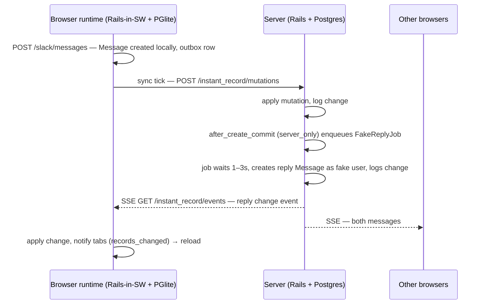
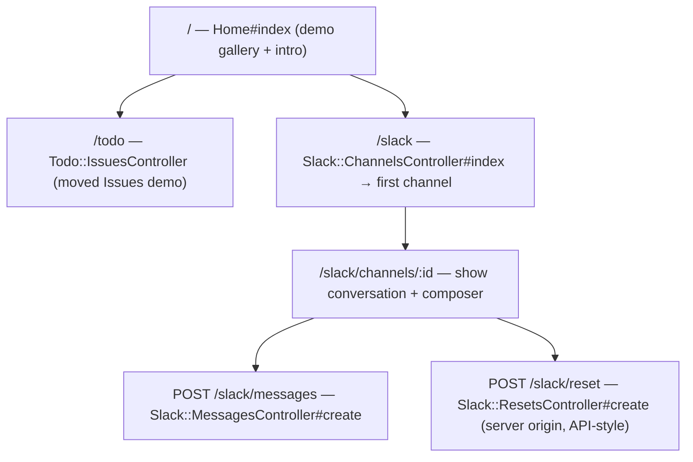

# Multi-Demo Restructure and Swiss Slack Demo - Plan

## Goal Capsule

- **Objective:** Restructure the demo Rails app so each demo lives under its own namespace, make the root page an index that introduces InstantRecord, and add a Slack-style demo ("Swiss Slack") with channels, DMs, users, fake-user replies pushed over SSE, and a database reset — all server-rendered HTML + Rails, styled in Swiss / International Typographic Style.
- **Authority:** This plan > repo conventions > implementer judgment. The Product Contract's settled decisions (HTML+Rails only, Swiss styling, fake users, reset) are user-directed and not open for re-litigation.
- **Stop conditions:** Stop if the restructure breaks the existing sync flow between server and browser runtime (the `instant_record_changes` log keys on model class names), or if fake-user replies require infrastructure the demo doesn't have (new queue backend, WebSockets).
- **Execution profile:** Standard depth, 7 implementation units; U7 (gem: server-side change logging) unblocks U5 and U6.

---

## Product Contract

### Summary

The demo app currently is the todo (Issues) app: it owns the root route and its views. This work turns `demo/` into a gallery of demo apps. The root page becomes an index introducing what InstantRecord is with links to each demo. The existing todo app moves under `/todo`. A new Slack-style demo lives under `/slack`: users, channels, and DMs, where posting a message triggers fake users to reply from the server — the reply arrives in the browser via the gem's existing SSE change stream, demonstrating server-push into the local-first runtime. A reset control restores the Slack demo to its seeded state. Everything is plain Rails controllers/views (HTML over the wire, no JS framework), styled in Swiss design.

### Problem Frame

There is one demo and it squats on the root route, so there is nowhere to add more demos and nothing that explains the library to a first-time visitor. The todo demo also only exercises self-inflicted changes; nothing demonstrates the SSE downstream path — another actor writing on the server and the change appearing in your browser — which is the library's most impressive trick.

### Requirements

**Restructure and index**

- R1. The todo (Issues) demo is served under a `/todo` path with its controller and views namespaced accordingly; its behavior (create, toggle done, destroy, sync badges, server-side "reject me" validation) is unchanged.
- R2. The root path `/` renders an index page: a short intro of what InstantRecord is (browser-run Rails models, offline writes, sync over SSE) and a card/link per demo app.
- R3. The demo app remains structured so a future demo is added by dropping in a new namespace (controller dir, views dir, routes scope, index card) without touching existing demos.

**Swiss Slack demo**

- R4. The Slack demo at `/slack` shows a sidebar of channels and DMs and a roster of users, and a message view for the selected conversation with a composer form.
- R5. Messages post via a plain Rails form (no JS framework); the message appears immediately from the local runtime (optimistic local write) and syncs to the server.
- R6. A set of fake users exists (seeded); they are display-only actors — there is no auth, and the visitor writes as a fixed "you" user.
- R7. When the visitor posts a message, one or more fake users reply after a short delay. The reply is created on the server and reaches the browser through the existing InstantRecord SSE change stream — no new realtime transport.
- R8. DMs are conversations between the visitor and a single fake user; posting in a DM gets a reply from that user.
- R9. The Slack demo works offline for composing: messages written offline queue in the outbox and deliver (and draw replies) when connectivity returns. This is inherited library behavior and must not be broken by the demo's modeling choices.

**Reset**

- R10. A reset control in the Slack demo restores the demo data to its seeded state for everyone — connected browsers converge to the reset state without manual cache clearing.

**Styling**

- R11. The demos and index are styled in Swiss / International Typographic Style: strict grid, Helvetica-stack typography, black/white with a single red accent, uppercase micro-labels, no decoration. The Slack demo may lean into the joke ("Swiss Slack").
- R12. Demo styling lives in shared stylesheets (Propshaft `demo/app/assets/stylesheets/`), not inline `<style>` blocks; the todo view's existing inline CSS moves there during the restructure.

### Scope Boundaries

- No auth or per-client data scoping — all data syncs to all clients (library limitation today; the demo embraces it).
- No LLM-generated replies — fake users reply from canned response pools.
- No message editing, threads, reactions, presence, or typing indicators.
- No JS beyond what already exists (the service-worker `records_changed` → reload listener) plus at most a tiny reset trigger (U6); no Turbo Streams, no Stimulus controllers.

**Deferred to Follow-Up Work**

- Replacing the full-page reload on `records_changed` with targeted DOM updates.
- A `syncable_to`-style per-client scoping demo once the library supports it.

### Acceptance Examples

- AE1. **Given** a fresh visit to `/`, **when** the page loads, **then** the visitor sees an intro of InstantRecord and cards linking to `/todo` and `/slack`.
- AE2. **Given** the Slack demo with seeded channels, **when** the visitor posts "hello" in `#general`, **then** the message renders immediately, and within a few seconds a fake user's reply appears without any manual refresh.
- AE3. **Given** the visitor is offline, **when** they post a message in a DM, **then** it renders locally with a pending sync badge, and after reconnecting it syncs and the DM partner replies.
- AE4. **Given** two browsers open on `/slack`, **when** the reset control is used in one, **then** both browsers converge to the seeded state.

---

## Planning Contract

### Key Technical Decisions

- **KTD1 — HTML + Rails only** (session-settled: user-directed — chosen over Turbo Streams/Stimulus enhancement: the demo's point is that plain ERB controllers/views run in the browser runtime; JS machinery would muddy it). Forms post normally with `data: { turbo: false }` like the Issues demo; live updates arrive via the existing service-worker `records_changed` → `location.reload()` listener, extracted into a shared layout-level snippet.
- **KTD2 — Namespace by demo, keep model names global.** Controllers and views move to `Todo::`/`Slack::` namespaces with `/todo` and `/slack` route scopes. Models stay top-level (`Issue`, `Channel`, `Message`, `ChatUser`): `InstantRecord.synced_model` constantizes `record_type` from the change log, so renaming `Issue` would orphan logged changes and complicate the sync allowlist for zero benefit in a demo.
- **KTD3 — Server-originated writes get change-logged in the gem.** Today only `InstantRecord::MutationApplier` (the client-mutation path) writes `instant_record_changes` rows; `Syncable` does nothing on server-side writes (`lib/instant_record/syncable.rb`). Fake replies and reset therefore require a gem extension: `Syncable` gains server-runtime callbacks that bump `server_version` and log an `InstantRecord::Change` row on create/update/destroy, guarded by a thread/fiber-local "applying client mutation" flag set by `MutationApplier` so client-applied mutations are not double-logged (chosen over demo-level manual `Change.create!` calls: server-push is a library capability, not demo glue, and manual logging is easy to get wrong). U7 owns this.
- **KTD4 — Fake replies via `server_only` callback + ActiveJob async adapter** (session-settled: user-approved — chosen over a thread-with-sleep hack: ActiveJob with the built-in `:async` adapter gives delayed execution with no new infrastructure). `Message` gets `server_only { after_create_commit :enqueue_fake_reply }`; a `Slack::FakeReplyJob` waits ~1–3 s and creates the reply as the target fake user. With KTD3 in place the reply is change-logged and flows to every browser over the existing SSE stream — no new transport. The guard: only messages authored by the visitor trigger replies (prevents bot reply loops).
- **KTD5 — Reset via change-logged destroys + reseed, not truncation** (chosen over `TRUNCATE`/`delete_all` with callbacks skipped: raw truncation bypasses the change log, so browsers would keep stale local rows forever). The reset endpoint runs on the real server, calls `destroy_all` on Slack models (each destroy change-logged per KTD3) and then re-creates the seed data (logged as creates). Connected clients converge through the normal SSE/catch-up path — satisfying R10 with zero client-side cache surgery.
- **KTD6 — DMs are channels with a `kind` column.** One `Channel` model with `kind` in `{"channel", "dm"}` and, for DMs, a `dm_user_id` pointing at the fake-user partner. Avoids a membership join table; the demo has no auth so membership carries no information.
- **KTD7 — Seeds are the single source of demo data.** `demo/db/seeds.rb` gains an idempotent Slack section (fake users, starter channels, one DM per fake user, welcome messages); the reset action reuses the same seed routine so "reset" and "fresh install" are the same state.
- **KTD8 — Shared Swiss stylesheet.** One `demo/app/assets/stylesheets/swiss.css` (grid, type scale, tokens) plus per-demo files; the todo view's inline `<style>` block moves out (R12). Propshaft's `stylesheet_link_tag :app` loads every file in the directory on every page, so per-demo files namespace their selectors under a body class (e.g. `.demo-slack`); the boilerplate `application.css` folds into this scheme or is removed.

### Assumptions

- The default ActiveJob `:async` adapter is acceptable for fake replies in a demo (replies are lost on server restart mid-delay; acceptable).
- Everything under `demo/app`, `demo/config`, `demo/db` is packed into `app.wasm`, so browser-side verification requires `bin/rails instant_record:build`; server-side tests do not.
- The deployed PWA's static `public/index.html` shadowing of `/` (noted in `demo/config/routes.rb`) is a deployment concern outside this plan; the Rails `root` route change is still correct for the in-browser runtime, which routes all fetches through Rack.
- Fake-reply jobs run on the server only; the browser runtime never enqueues them (`server_only` guarantees this).

### High-Level Technical Design

Message flow for a fake reply (R7):

Route map:

---

## Implementation Units

### U1. Move the Issues demo under /todo and extract shared view chrome

- **Goal:** The todo demo lives at `/todo` in its own namespace; the shared layout gains the `records_changed` reload listener and shared stylesheet hooks so future demos inherit them.
- **Requirements:** R1, R3, R12 (partial — extraction of inline CSS)
- **Dependencies:** none
- **Files:** `demo/app/controllers/todo/issues_controller.rb` (moved from `demo/app/controllers/issues_controller.rb`), `demo/app/views/todo/issues/index.html.erb` (moved from `demo/app/views/issues/index.html.erb`), `demo/app/views/layouts/application.html.erb`, `demo/app/assets/stylesheets/swiss.css`, `demo/app/assets/stylesheets/todo.css`, `demo/config/routes.rb`, `demo/test/controllers/todo/issues_controller_test.rb` (moved from `demo/test/controllers/issues_controller_test.rb`)
- **Approach:** Rename `IssuesController` to `Todo::IssuesController`; wrap routes in `scope "/todo", module: :todo` (or `namespace :todo`) with named routes the views use. Redirects that pointed at `root_path` now point at the todo index path. `Issue` model stays top-level (KTD2). Move the view's inline `<style>` into `todo.css` and the inline `records_changed` script into the shared layout (all demos need reload-on-change). Temporarily keep `root` pointing at the todo index until U2 replaces it, so the app never lacks a root route.
- **Patterns to follow:** existing `RuntimeScoped` usage in the current `issues_controller.rb` (`browser_only { skip_forgery_protection }`, `server_only` before_action) — preserve verbatim.
- **Test scenarios:**
  - Happy path: GET `/todo` renders the issues list; POST create redirects back to `/todo` and persists; PATCH toggles `state`; DELETE removes.
  - Covers R1: server-side validation still rejects title "reject me".
  - Edge: root route still resolves (no 404) after the move.
- **Verification:** `cd demo && bin/rails test` green; manually confirm `/todo` renders with styles applied from the stylesheet, not inline.

### U2. Root index page introducing InstantRecord

- **Goal:** `/` renders a Swiss-styled gallery: what InstantRecord is, one card per demo.
- **Requirements:** R2, R3, R11
- **Dependencies:** U1
- **Files:** `demo/app/controllers/home_controller.rb`, `demo/app/views/home/index.html.erb`, `demo/app/assets/stylesheets/swiss.css`, `demo/config/routes.rb`, `demo/test/controllers/home_controller_test.rb`
- **Approach:** Static controller/view — no models. Intro copy distilled from `README.md` (browser-run Rails models, offline writes, outbox sync, SSE downstream). Cards for Todo and Slack (Slack card links to `/slack`; until U4 lands the route can 404 in dev — acceptable ordering within one branch, or land the link text in U4). `root "home#index"` replaces the temporary todo root.
- **Test scenarios:**
  - Covers AE1: GET `/` responds 200 and includes links to `/todo` and `/slack`.
  - Test expectation beyond that: none — static page.
- **Verification:** `cd demo && bin/rails test`; visual check of grid/typography.

### U3. Slack data model, migrations, and seeds

- **Goal:** `ChatUser`, `Channel`, `Message` exist as syncable models with idempotent seed data (fake users, channels, DMs, welcome messages).
- **Requirements:** R4, R6, R8 (model shape), R9 (syncable columns), and KTD6/KTD7
- **Dependencies:** none (parallel with U1/U2)
- **Files:** `demo/db/migrate/*_create_chat_users.rb`, `*_create_channels.rb`, `*_create_messages.rb`, `demo/db/schema.rb`, `demo/app/models/chat_user.rb`, `demo/app/models/channel.rb`, `demo/app/models/message.rb`, `demo/app/models/slack/seeds.rb`, `demo/db/seeds.rb`, `demo/test/models/message_test.rb`
- **Approach:** Every table follows the Syncable shape from `demo/db/migrate/20260721000001_create_issues.rb`: `id: :string`, `server_version: integer`, `sync_state: string`. `ChatUser`: `name`, `handle`, `bot:boolean` (visitor row has `bot: false`, fixed well-known id e.g. `"you"`). `Channel`: `name`, `kind` (`channel`/`dm`), `dm_user_id:string` (nullable). `Message`: `channel_id:string`, `chat_user_id:string`, `body:text`. Models include `InstantRecord::Syncable`; `Message` validates `body` presence. Associations use explicit string FKs (no DB-level FK constraints needed — PGlite parity and demo simplicity). Seeds create ~4 fake users with distinct voices, `#general` + `#random` + one more channel, a DM channel per fake user, and a welcome message per conversation — all `find_or_create_by` on fixed ids so reseeding is idempotent (KTD7); wrap the seed routine in a reusable method/module (e.g. `Slack::Seeds.apply`) so U6's reset calls the same code.
- **Patterns to follow:** `demo/app/models/issue.rb` for Syncable inclusion and `server_only` validation blocks.
- **Test scenarios:**
  - Happy path: creating a Message with valid channel/user persists and gets `sync_state` handling from Syncable.
  - Edge: Message without body is invalid; Channel `kind` restricted to the two values.
  - Idempotency: running the seed routine twice yields no duplicate rows.
- **Verification:** `cd demo && bin/rails db:migrate db:seed` clean on repeat runs; model tests green.

### U4. Slack demo UI — channels, DMs, composer, Swiss styling

- **Goal:** `/slack` is a working chat UI: sidebar (channels, DMs, user roster), conversation view, message composer — plain ERB, Swiss-styled.
- **Requirements:** R4, R5, R6, R11, R12
- **Dependencies:** U1 (shared layout/reload listener, stylesheet conventions), U3
- **Files:** `demo/app/controllers/slack/channels_controller.rb`, `demo/app/controllers/slack/messages_controller.rb`, `demo/app/views/slack/channels/index.html.erb` (or redirect-to-first), `demo/app/views/slack/channels/show.html.erb`, `demo/app/views/slack/channels/_sidebar.html.erb`, `demo/app/assets/stylesheets/slack.css`, `demo/config/routes.rb`, `demo/test/controllers/slack/channels_controller_test.rb`, `demo/test/controllers/slack/messages_controller_test.rb`
- **Approach:** `GET /slack` redirects to the first channel (`Slack::ChannelsController#index`); `show` renders sidebar + messages (ordered by `created_at`, then `id` as tiebreak — browser-clock and server-clock timestamps mix, so minor skew-driven reorder is accepted demo behavior) + composer form posting to `Slack::MessagesController#create` with `data: { turbo: false }`, author forced to the visitor user server-side (never trust a form field for author). Sync-state badges on own messages mirror the Issues demo. Controllers copy the `RuntimeScoped` pattern from the Issues controller. Swiss styling: two-column grid, Helvetica stack, red accent for the active channel and send button, uppercase channel labels; title the demo "Swiss Slack".
- **Patterns to follow:** `demo/app/controllers/todo/issues_controller.rb` (post-U1) for RuntimeScoped + redirect-back flow; sync badge markup from the todo view.
- **Test scenarios:**
  - Happy path: GET `/slack` redirects to a channel; GET channel shows seeded welcome message; POST message persists with visitor as author and redirects back to the channel.
  - Covers R5/AE2 (server half): posted message renders in the channel on the redirected GET.
  - Edge: posting an empty body re-renders/redirects without creating; unknown channel id 404s.
  - Security-ish: a forged `chat_user_id` param is ignored — author is always the visitor.
- **Verification:** `cd demo && bin/rails test`; manual browser check of layout and message flow.

### U5. Fake user replies over SSE

- **Goal:** Posting as the visitor triggers a delayed fake-user reply created on the server, which reaches browsers through the existing SSE change stream.
- **Requirements:** R7, R8; KTD4
- **Dependencies:** U3, U7 (U4 for end-to-end manual proof)
- **Files:** `demo/app/models/message.rb`, `demo/app/jobs/slack/fake_reply_job.rb`, `demo/test/jobs/slack/fake_reply_job_test.rb`, `demo/test/models/message_test.rb`
- **Approach:** In `Message`, `server_only { after_create_commit :enqueue_fake_reply }` guarded to visitor-authored messages only (KTD4's loop guard — a bot-authored message never enqueues). The job picks the responder: the DM partner for DMs, a random fake user (weighted to vary) for channels; waits via `set(wait: rand(1.0..3.0).seconds)` at enqueue time; creates a reply from a canned response pool per user voice (arrays in the job or a small constant module — no external services). Reply text can echo playful Swiss flavor. With U7's server-side change logging in place, the reply's create is logged and the events SSE endpoint delivers it; nothing new to build on the transport side.
- **Execution note:** Write the callback test first asserting enqueue behavior (visitor message enqueues, bot message does not) — the loop guard is the one real failure mode here.
- **Test scenarios:**
  - Happy path: visitor message in a channel enqueues `FakeReplyJob`; performing it creates a Message from a bot user in the same channel.
  - Covers R8: visitor message in a DM gets the reply authored by exactly the DM partner.
  - Loop guard: a bot-authored message enqueues nothing (assert no jobs).
  - Edge: job performs gracefully if the channel was deleted before it ran (reset race — discard, don't raise).
- **Verification:** `cd demo && bin/rails test`; manual two-browser check that the reply appears in a second browser without interaction (AE2 downstream half).

### U6. Slack demo reset

- **Goal:** A reset control restores the Slack demo to seed state and converges all connected browsers.
- **Requirements:** R10; KTD5, KTD7
- **Dependencies:** U3, U4, U7
- **Files:** `demo/app/controllers/slack/resets_controller.rb`, `demo/config/routes.rb`, sidebar/view button in `demo/app/views/slack/channels/_sidebar.html.erb`, `demo/test/controllers/slack/resets_controller_test.rb`
- **Approach:** `POST /slack/reset`. The destroys and reseeds must run on the *real server* — only the server's change log propagates to other clients. Inside the PWA a normal form post is handled by the browser runtime's Rack handler, so the reset request must reach the server origin directly (the same origin the gem's `/instant_record/*` endpoints use). Follow the gem's server-endpoint pattern (`app/controllers/instant_record/mutations_controller.rb`): API-style controller without forgery protection, CORS headers — a cross-origin form post carries no valid CSRF token, and inheriting the demo `ApplicationController` would raise InvalidAuthenticityToken. Invoke via a small fetch call or a form that redirects back to the PWA origin so the visitor stays in the app. This routing shape is directional guidance — the implementer verifies what works in the runtime; the hard requirement is that deletion/reseed happen server-side and propagate via the change log. Server side: `Message.destroy_all`, then channels and users outside the seed set, then rerun `Slack::Seeds.apply`. Destroys and creates are individually logged (KTD5 via U7) so clients converge over SSE/catch-up.
- **Test scenarios:**
  - Covers R10/AE4 (server half): POST reset with extra user messages present leaves exactly the seed rows; each destroyed row has a corresponding change-log delete event; seed rows re-exist.
  - Cross-origin shape: POST without a CSRF token succeeds and the response carries the gem's CORS headers.
  - Idempotency: reset twice in a row is safe.
  - Edge: reset while a `FakeReplyJob` is pending doesn't raise (pairs with U5's discard behavior).
- **Verification:** controller test green; manual two-browser convergence check.

### U7. Gem: change-log server-originated Syncable writes

- **Goal:** Server-side creates/updates/destroys on `Syncable` models bump `server_version` and write `instant_record_changes` rows, so server-originated data (fake replies, reset) propagates to clients over the existing SSE stream.
- **Requirements:** enables R7, R10; KTD3
- **Dependencies:** none (unblocks U5, U6)
- **Files:** `lib/instant_record/syncable.rb`, `app/models/instant_record/mutation_applier.rb`, `test/syncable_test.rb`
- **Approach:** Extend `Syncable`'s server-runtime path: when not in the browser and not inside `MutationApplier` (a thread/fiber-local flag the applier sets around `perform`), after create/update/destroy assign `server_version` (initialize to 1 on create, increment on update) and write an `InstantRecord::Change` row mirroring `MutationApplier#log_change`/`log_destroy` payload shapes, inside the same transaction. Keep `sync_state` `"synced"` for server-originated rows. The flag guard is the critical piece — without it every client mutation would be logged twice.
- **Patterns to follow:** `log_change`/`log_destroy` in `app/models/instant_record/mutation_applier.rb` for the Change row shape; runtime guards in `lib/instant_record/syncable.rb` (`instant_record_local_write?`) for callback gating style.
- **Test scenarios:**
  - Happy path: a server-side create on a Syncable model writes exactly one Change row with operation "create", version 1, and the record's attributes minus `sync_state`; update increments version and logs; destroy logs a destroy event.
  - Double-log guard: applying a client mutation through `MutationApplier` produces exactly one Change row (the applier's), not two.
  - Browser runtime: with the runtime stubbed to browser, no Change rows are written (outbox behavior unchanged).
- **Verification:** `bundle exec rake test` green, including existing sync-loop and syncable tests unchanged in behavior.

---

## Verification Contract

| Gate | Command | Applies to |
|---|---|---|
| Demo app tests | `cd demo && bin/rails test` | U1–U6 |
| Gem tests | `bundle exec rake test` | U7 plus whole-branch regression |
| Migrations + seeds idempotent | `cd demo && bin/rails db:migrate db:seed` run twice | U3, U6 |
| Browser smoke (manual, non-blocking for CI) | `bin/rails instant_record:build`, `cd demo/pwa && yarn dev --host`, walk AE1–AE4 | U2, U4, U5, U6 |

The wasm rebuild is required only for in-browser verification; server-side test gates are the merge bar.

## Definition of Done

- All R1–R12 satisfied; AE1 and the server halves of AE2–AE4 covered by automated tests.
- `cd demo && bin/rails test` and `bundle exec rake test` green.
- No inline `<style>` blocks remain in demo views (R12); no new JS beyond the shared reload listener and the minimal reset trigger.
- Old `issues_controller.rb`/`views/issues/` paths removed — no dead files from the move.
- Seeds and reset share one code path (`Slack::Seeds.apply` or equivalent).
- No abandoned experimental code in the diff.
