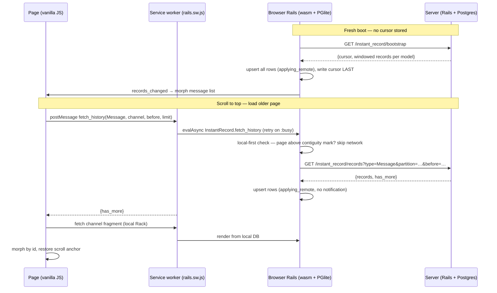
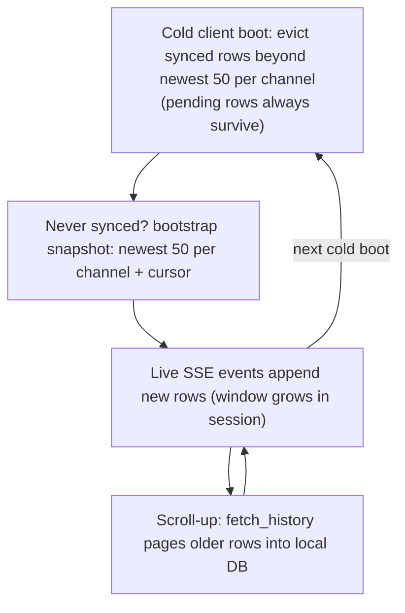

# Windowed Sync and Slack Infinite Scroll - Plan

## Goal Capsule

- **Objective:** Add infinite scroll to the Slack demo backed by a gem-level windowed sync capability: syncable models can declare a sync window, fresh clients hydrate from a windowed bootstrap snapshot instead of replaying the whole change log, older rows stream in on demand through keyset-cursor pages, and the local database is evicted back to the window at boot — so the demo supports thousands of server rows without bloating the browser database, and scrolling is smooth (no full-page reloads on the conversation view).
- **Authority:** This plan > repo conventions > implementer judgment. The user directives (capability lives in the gem, not demo glue; support lots of rows without crashing either database; smooth/seamless scrolling) are fixed; mechanism details marked "directional" are the implementer's call.
- **Stop conditions:** Stop if `vm.evalAsync` from a service-worker message handler proves unworkable in the browser runtime AND the documented fallback (guarded in-request fetch) is also unstable — that invalidates KTD4. Stop if PGlite cannot execute the window-function eviction/window queries (fallback to a per-partition loop first; stop only if both fail).
- **Execution profile:** Deep, 9 implementation units. U1 unblocks U2/U4; U2 unblocks U3/U6; U3 unblocks U5/U7; U5 and U7 unblock U8; U9 follows U1–U5. Browser-runtime verification requires a wasm rebuild (`bin/rails instant_record:build`); server-side test gates are the merge bar.

---

## Product Contract

### Summary

Today every row of every syncable model syncs to every client, a fresh browser hydrates by replaying the entire `instant_record_changes` log from cursor 0, and the Slack channel view loads all messages with no limit — three ceilings that fall over at "lots of rows". This work adds windowed sync to the gem (`sync_window` declaration, bootstrap snapshot hydration, on-demand history pages with keyset cursors, boot-time local eviction) and uses it in the Slack demo: channels seed thousands of messages, a fresh client boots with only the newest window per conversation, scrolling up streams older pages in seamlessly, and live updates morph the DOM in place instead of reloading the page.

### Problem Frame

The Slack demo cannot demonstrate a realistic message history: seeding thousands of messages would make every fresh client replay every change event (one giant SSE body, thousands of wasm upserts, unbounded IndexedDB growth) — the dogfood report already escalated "add a bootstrap endpoint that serves current state + cursor" as the fix for exactly this. Separately, the demo re-renders by full page reload on every synced change, which resets scroll position — fatally at odds with reading scrollback while fake users keep replying. There is no pagination, windowing, or eviction anywhere in gem or demo today.

### Requirements

**Gem: windowed sync capability**

- R1. A syncable model can declare a sync window (row limit, optional partition column, e.g. newest 50 messages per channel); models without a declaration keep today's full-sync behavior unchanged.
- R2. A client that has never synced hydrates from a bootstrap snapshot (windowed current state plus the change-log cursor) instead of replaying the change log from 0; clients that already have a cursor are unaffected.
- R3. Older rows of a windowed model can be fetched on demand: a server endpoint serves keyset-cursor pages (bounded, index-friendly, no OFFSET), and a client API applies them to the local database idempotently without creating outbox mutations, reporting whether more rows exist. Pages already present locally are served without a network hit.
- R4. The local database stays bounded: at client boot, windowed models are trimmed back to their declared window per partition; rows with `sync_state: "pending"` are never evicted.
- R5. New endpoints follow the engine's conventions: CORS headers, `record_type` validated through `InstantRecord.synced_model`, payloads shaped like change events (`attributes` minus `sync_state`, including `server_version`), block-scoped connection use, no auth (existing PoC posture).
- R6. Existing sync-loop guarantees hold: single-flight ticks, cursor persisted only after a batch (or full snapshot) applies so crashes re-apply idempotently, transport failures logged and retried on the next tick — a failed bootstrap must retry, never fall through to a cursor-0 log replay.

**Demo: infinite scroll UX**

- R7. The Slack demo seeds a deep message history (thousands of rows) without flooding the change log, and reset preserves that history while remaining fast and convergent for connected clients.
- R8. The channel view renders only the newest window initially; scrolling to the top loads older pages with stable scroll position (no jumps, no duplicate rows), ending in a visible "beginning of channel" state.
- R9. On the Slack conversation view, synced changes update the DOM in place (new messages appear, destroyed messages disappear, own-message sync badges flip) without a full page reload; the view auto-scrolls only when the user was already at the bottom. Other demo pages keep the existing reload behavior.
- R10. Offline degrades gracefully: composing still queues via the outbox, already-fetched history scrolls locally, fetching beyond local shows an offline notice, and scrolling recovers on reconnect.
- R11. The same conversation page works served directly by the Rails server (no service worker): pagination pages from the server database through the same fragment contract.

### Scope Boundaries

- No per-client authorization scoping of the stream (`syncable_to`) — windowing bounds volume, not visibility; all data still syncs to all clients.
- No change-log pruning or compaction, and no "cursor too old → forced re-bootstrap" recovery; long-offline clients still replay their gap (accepted at demo scale).
- Page-side infinite-scroll wiring (IntersectionObserver, fragment morph, composer interception) is demo code by design; the gem's public surface ends at `fetch_history` and the service-worker message protocol.
- No notifier payload enrichment — `records_changed` stays a one-bit signal; the Slack page re-derives state from the local database.
- No message editing, threads, unread markers, or presence.
- No new runtime gem dependencies (wasm bundle size is actively managed).

**Deferred to Follow-Up Work**

- A public bulk-import API that suppresses server change logging (`InstantRecord.without_change_log`-style) — this plan sidesteps it by seeding backfill with `insert_all`.
- Re-bootstrap when a returning client's catch-up gap is huge.
- A bounded batch size for catch-up polls (`Change.poll` is unbounded today; bootstrap removes the worst case — the fresh client).

### Acceptance Examples

- AE1. **Given** ~5,000 seeded messages in `#general`, **when** a fresh browser opens `/slack`, **then** the page shows the newest window within a few seconds and the local `messages` table holds roughly the window size per channel — not thousands of rows.
- AE2. **Given** the visitor is in `#general`, **when** they scroll to the top repeatedly, **then** older pages append with the viewport stable, until "beginning of #general" renders.
- AE3. **Given** the visitor is scrolled up reading history, **when** a fake-user reply arrives over SSE, **then** the page does not reload or jump; the new message is present when they return to the bottom. **Given** they send a message, **then** it appears immediately and its badge flips `pending → synced` without a reload.
- AE4. **Given** the visitor is offline, **when** they scroll past locally-held history, **then** an offline notice renders instead of a spinner loop; composing still queues and drains on reconnect.
- AE5. **Given** two browsers on `/slack`, **when** one resets the demo, **then** the other converges: visitor-era messages disappear (from the DOM too — no ghosts), seeded history remains.
- AE6. **Given** the todo demo, **when** this branch ships, **then** its behavior is unchanged (full sync, reload-on-change).

---

## Planning Contract

### Key Technical Decisions

- **KTD1 — Windowed sync is a gem capability declared on the model.** `sync_window limit: 50, partition_by: :channel_id` on `InstantRecord::Syncable` models (ordering fixed to `created_at, id` — the demo's display order). The user directed "built in the gem and just work"; research confirms the shape: it mirrors ElectricSQL shapes / Zero query-driven partial replication, and the prior Slack plan's KTD3 set the precedent that sync behavior is library capability, not demo glue. Windowless models keep full sync — the todo demo is untouched.
- **KTD2 — Fresh clients hydrate from a bootstrap snapshot, not change-log replay.** New engine endpoint returns `{cursor, records}` where `cursor = Change.maximum(:id)` is captured **before** reading rows (in one transaction): overlap between snapshot and subsequent events is re-applied idempotently (upsert + LWW), whereas the reverse order would skip events. Client-side, "never synced" is `SyncMetadata.get("cursor").nil?` (today's `.to_i` conflates nil with 0); the cursor is written only after **all** snapshot rows apply, so a mid-bootstrap crash retries cleanly; a failed bootstrap retries next tick and never falls through to a cursor-0 poll. This implements the escalated decision in `docs/dogfood-reports/2026-07-22-feat-swiss-slack-demo-dogfood.md` ("bootstrap endpoint… when data volume makes replay slow"). Accepted gap, shared with today's incremental poll: change ids are assigned before commit, so a writer still in flight during the snapshot read can commit a lower-id change that cursor-based polling never returns — accepted at demo scale alongside the long-offline replay gap.
- **KTD3 — History pages use keyset cursors, never OFFSET.** `(created_at, id)` descending, `created_at` serialized as `iso8601(6)` so boundary rows neither duplicate nor vanish; server clamps `limit`; the demo adds a `(channel_id, created_at, id)` index. Row payloads reuse the change-event convention (`attributes.except("sync_state")`, `server_version` included) so `Client.upsert_from_server` applies them unchanged and LWW keeps working.
- **KTD4 — History fetches enter the VM through a service-worker message, sharing the tick's single-flight guard.** Asyncify re-entrancy is the repo's known crash class, so `InstantRecord.fetch_history` is never called inside a Rack request. Page JS posts a message; the SW runs `vm.evalAsync(...)` with retry-on-`:busy`; the reply carries `has_more`. `fetch_history` checks the local database first (already-fetched pages and offline scrollback are served without a network hit) and does **not** fire `records_changed` — the requesting page refreshes itself; other tabs don't need history they didn't ask for. Fallback if evalAsync-from-message proves unstable: a guarded in-request fetch (execution-time discovery; see stop conditions).
- **KTD5 — Eviction runs once per cold client boot, not per sync pass.** Trimming each windowed model to `limit` per partition (`delete_all` with `sync_state != 'pending'` in the WHERE, wrapped in `applying_remote`) at the first sync pass of a VM session. Chosen over per-pass eviction, which could delete a just-fetched page between apply and render (refetch loops) and yank scrollback mid-read. Browsers also terminate idle service workers and restart them on the next event, so a mid-read VM restart must not count as a fresh boot: the service worker passes a cold-start flag into the first tick (evict only when no window clients were controlled at VM init), so an idle-restart under an open conversation page skips the trim. Within a session the local set grows only by live arrivals and explicit scrolling — bounded; the next cold boot trims it back. Live-stream updates to previously evicted rows re-create them locally (upsert semantics); the next cold boot re-trims — accepted.
- **KTD6 — The Slack conversation view swaps full-page reload for morph-by-id.** On `records_changed`, fetch the page from the local runtime and reconcile the message list by record id (insert new, remove missing, update badge classes), replace the sidebar, preserve composer state and scroll (bottom-pinned only when at bottom). Membership is "present in the local database", not a timestamp comparison — this sidesteps the mixed browser/server clock skew that a time-anchored refresh would mishandle (messages vanishing below the anchor) and removes reset ghosts (destroyed ids drop out of the DOM). A failed or 404 fragment fetch falls back to navigation. The prior plan's reload listener stays for every other page; this stays vanilla JS — no Turbo, no Stimulus — consistent with that plan's user-directed HTML-first stance, and it is the previously-deferred "targeted DOM updates" follow-up, now due because of the "super smooth and seamless" directive.
- **KTD7 — Deep history is seeded with `insert_all` and no change-log rows.** `Syncable` change-logs every server write, so a callback-driven backfill would write thousands of `Change` rows and freeze every already-synced client replaying them inside wasm ticks. `insert_all` (deterministic `backfill-` ids, explicit `server_version: 1`, `sync_state: "synced"`, timestamps spread over past weeks) skips both. Fresh clients still see the history because bootstrap reads tables, not the log; pre-existing clients reach it via scroll-up only — accepted. Reset destroys only non-seed, non-backfill messages, so it stays fast and connected clients converge through ordinary destroy events.
- **KTD8 — Composer becomes a progressively-enhanced fetch POST.** JS submits to the local runtime and refreshes the list immediately (optimistic local write is already instant); the plain form POST remains the no-JS fallback. Chosen over keeping full-page navigation on send, which would discard loaded scrollback and flash the page on every message.

### Assumptions

- "Revocation" in the request means local eviction of synced rows (plus on-demand re-fetch), not authorization revocation.
- Demo scale target is thousands of seeded messages (default ~5,000 in `#general`, tunable; tests use a small count). The window is 50 per channel.
- Mixed browser/server clocks skewing `created_at` ordering is accepted demo behavior (stance carried from the Slack demo plan); KTD6's id-based membership ensures skew cannot make messages disappear.
- New endpoints stay auth-less like the rest of the sync engine (documented PoC posture).
- Chrome remains the only target browser; one tab owns the database.
- Window functions (`row_number() OVER (PARTITION BY …)`) are available in server Postgres, PGlite, and the gem test suite's SQLite (3.25+).

### High-Level Technical Design

Fresh-client hydration and scroll-back flows:

Window lifecycle per partition (Message, `keep = 50`):

---

## Implementation Units

### U1. Gem: `sync_window` declaration and window queries

- **Goal:** Syncable models can declare a window; the gem can compute "rows inside the window" and "rows beyond the window" for any declared model.
- **Requirements:** R1
- **Dependencies:** none
- **Files:** `lib/instant_record/syncable.rb`, `lib/instant_record/sync_window.rb` (new), `lib/instant_record.rb` (require), `test/sync_window_test.rb` (new)
- **Approach:** Class macro `sync_window(limit:, partition_by: nil)` storing a small spec object on the class; ordering is fixed `(created_at, id)`. Provide two relation builders used by bootstrap (U2), the records endpoint (U3), and eviction (U4): newest-`limit`-per-partition and its inverse. Implement with `row_number() OVER (PARTITION BY … ORDER BY created_at DESC, id DESC)`; if SQLite/PGlite quirks bite, fall back to a per-partition loop (partitions are few in practice). Invalid options (unknown column, non-positive limit) fail fast at first use.
- **Patterns to follow:** `RuntimeScoped`-style small module; spec storage like `class_methods do` in `lib/instant_record/syncable.rb`.
- **Test scenarios:**
  - Happy path: windowed model with `partition_by` returns exactly the newest N per partition; without `partition_by` returns the newest N overall.
  - Edge: partitions with fewer than N rows return all their rows; ties on `created_at` break by `id`.
  - Edge: model without `sync_window` reports no window (helpers return nil/full scope).
  - Error: unknown partition column raises with a clear message.
- **Verification:** `bundle exec rake test` green.

### U2. Gem: bootstrap snapshot endpoint and client hydration

- **Goal:** A fresh client hydrates from `GET /instant_record/bootstrap` (windowed state + cursor) instead of replaying the change log.
- **Requirements:** R2, R5, R6
- **Dependencies:** U1
- **Files:** `app/controllers/instant_record/bootstraps_controller.rb` (new), `config/routes.rb`, `lib/instant_record/client.rb`, `lib/instant_record/client/transport.rb` (add `get_json`), `test/bootstrap_test.rb` (new), `test/sync_loop_test.rb` (FakeTransport gains `get_json`; existing poll-path tests pre-seed a cursor so they exercise the non-bootstrap branch), `demo/app/models/message.rb` (`sync_window limit: 50, partition_by: :channel_id` — declared here so U2/U3 demo tests have a windowed model; U7 consumes it), `demo/test/controllers/instant_record/bootstraps_controller_test.rb` (new)
- **Approach:** Server: inside one transaction, read `cursor = Change.maximum(:id) || 0` **first**, then serialize each synced model (allowlist when set, else eager-loaded `Syncable` includers — mirror how `synced_model` resolves; eager-load guard for dev) as windowed rows (U1) or all rows, payload per row `{type, id, version, attributes}` with the `attributes.except("sync_state")` convention. Merge `InstantRecord::CORS_HEADERS`. Client: `sync_pass` becomes drain → (bootstrap when `SyncMetadata.get("cursor").nil?`, else `poll_changes`) → notify. Bootstrap applies every row via `upsert_from_server` under `applying_remote`, writes the cursor once at the end, returns changed=true. `Transport::Error` logs and retries next tick — never fall through to a cursor-0 poll.
- **Execution note:** Test-first with the `FakeTransport` seam (`test/sync_loop_test.rb` pattern) — the cursor-ordering and crash-retry semantics are the substance of this unit.
- **Test scenarios:**
  - Covers AE1 (protocol half): fresh client (no cursor key) calls bootstrap, applies rows, stores the returned cursor; subsequent tick polls `/events?after=<cursor>`.
  - Idempotency: applying the same snapshot twice yields identical rows (crash-before-cursor-write retry).
  - Existing client: cursor key present → no bootstrap request issued.
  - Failure: bootstrap transport error → cursor stays nil, no `/events` poll from 0 this pass, next tick retries bootstrap.
  - Controller (demo integration): response has CORS headers; windowed model contributes only newest-N-per-partition; cursor reflects the change log; a change committed after the response's cursor re-applies safely client-side (documented by test on the client half).
  - Browser runtime: `record_outbox_mutation` never fires during snapshot apply (no outbox pollution).
- **Verification:** `bundle exec rake test` and `cd demo && bin/rails test` green.

### U3. Gem: history pages — records endpoint and `fetch_history`

- **Goal:** Older rows of a windowed model stream in on demand through keyset pages, applied locally without outbox noise.
- **Requirements:** R3, R5
- **Dependencies:** U1 (window spec), U2 (`get_json`)
- **Files:** `app/controllers/instant_record/records_controller.rb` (new), `config/routes.rb`, `lib/instant_record.rb` (public `fetch_history`), `lib/instant_record/client.rb`, `test/fetch_history_test.rb` (new), `demo/test/controllers/instant_record/records_controller_test.rb` (new)
- **Approach:** Endpoint: `GET /instant_record/records?type=…&partition=…&before_created_at=…&before_id=…&limit=…`. Validate `type` via `InstantRecord.synced_model` and require a declared `sync_window`; require `partition` when the window declares `partition_by`; clamp `limit` (default = window limit, hard max 200). Query: partition equality + keyset `(created_at, id) <` before-tuple, ordered descending, limit+1 to derive `has_more`. `created_at` params round-trip `iso8601(6)`. Client: `InstantRecord.fetch_history(model, partition:, before:, limit:)` — on the server runtime it's a pure local query; in the browser it serves locally when the page is known-contiguous, otherwise fetches, applies each row via `upsert_from_server` under `applying_remote` **without** firing `records_changed`, and returns `{applied:, has_more:}`. Local-first is gated by a per-partition contiguity low-water mark held in VM-session memory (row count alone can hide gaps from re-created evicted rows): initialized to the oldest row of the boot window, extended by each applied history page; serve locally only when `before` is newer than the mark, returning the last server-reported `has_more` for that partition (or true when none exists yet). Shares the tick's single-flight flag bidirectionally: `fetch_history` returns `:busy` while a pass is in flight (caller retries), and a tick skips while a history fetch is mid-flight.
- **Execution note:** Test-first under CRuby with `FakeTransport` — the busy-guard, local-first short-circuit, and no-notification behaviors are the failure modes.
- **Test scenarios:**
  - Happy path: fetch applies rows locally, returns `has_more` true when the server said so; no outbox mutations created.
  - Local-first: when the requested page sits above the contiguity low-water mark, no transport call is made; a page below the mark fetches even when `limit` local rows exist (gap protection).
  - Busy: called while a tick is in flight → `:busy`, nothing fetched.
  - Endpoint: correct keyset ordering across a page boundary (no duplicate, no gap — microsecond-precision timestamps); limit clamped; unknown type → 404; windowless type → 422; missing partition when required → 400; CORS headers present; rows include `server_version`.
  - Offline: transport error surfaces as a distinguishable return (not an exception crashing the caller).
- **Verification:** `bundle exec rake test` and `cd demo && bin/rails test` green.

### U4. Gem: boot-time eviction

- **Goal:** The local database is trimmed back to each declared window at client boot.
- **Requirements:** R4
- **Dependencies:** U1
- **Files:** `lib/instant_record/client.rb`, `test/eviction_test.rb` (new)
- **Approach:** On the first sync pass of a cold VM boot (session flag on `Client`, armed only when the boot is cold per KTD5 — the SW passes the flag; U5 wires it), before drain: for each windowed synced model, `delete_all` rows beyond the newest `limit` per partition with `sync_state != 'pending'` in the WHERE clause, wrapped in `applying_remote`. Windowless models untouched. Browser runtime only.
- **Test scenarios:**
  - Happy path: 120 synced rows in one partition with `limit: 50` → 50 remain (the newest by `created_at, id`).
  - Pending protection: a `pending` row older than the window survives; synced siblings are trimmed.
  - Partition isolation: trimming one partition leaves others intact.
  - Once per boot: second sync pass does not evict again (new live rows accumulate within the session).
  - Warm restart: when the cold-start flag is not armed (idle SW restart under an open page), no eviction runs.
  - No outbox rows are produced by eviction.
- **Verification:** `bundle exec rake test` green.

### U5. Gem: service-worker fetch_history message protocol

- **Goal:** Page JS can ask the VM for older rows without entering the VM from a Rack request.
- **Requirements:** R3 (delivery path), KTD4
- **Dependencies:** U3
- **Files:** `lib/generators/instant_record/install/templates/rails.sw.js`, `demo/pwa/rails.sw.js` (kept in sync via `rake pwa:sync`), `lib/instant_record.rb` (`fetch_history_json` string-interop wrapper), `test/fetch_history_test.rb` (wrapper coverage)
- **Approach:** Add a `message` handler case: `{type: "instant_record.fetch_history", request: {…}}` with a `MessageChannel` port. The SW runs `vm.evalAsync("InstantRecord.fetch_history_json(<json literal>)")`, retrying a small number of times on `:busy` (setTimeout backoff), and replies `{ok, has_more, error}`. `fetch_history_json` parses the JSON request, resolves the model via `InstantRecord.synced_model`, delegates to `fetch_history`, and returns a JSON string (clean wasm interop, no JS object bridging). The SW also wires KTD5's cold-start flag: at VM init, check `clients.matchAll` for already-controlled window clients and pass the result into the first tick so U4 evicts only on cold boots. Keep the template and demo copy byte-identical apart from `BUILD_VERSION`.
- **Test scenarios:**
  - `fetch_history_json`: valid request round-trips to `fetch_history` and serializes the result; unknown type returns a JSON error; malformed JSON returns a JSON error (never raises across the interop boundary).
  - Test expectation for the JS handler: none — service-worker template, covered by the browser smoke walk (AE2).
- **Verification:** `bundle exec rake test` green; after `cd demo && rake pwa:sync`, `git diff demo/pwa/rails.sw.js` touches only the `BUILD_VERSION` line. **Kill-gate (run before starting U6–U8):** `bin/rails instant_record:build`, serve the PWA, and from a page console post an `instant_record.fetch_history` message while sync ticks are scheduled; confirm a clean evalAsync round-trip including the retry-on-`:busy` path — this retires the plan's highest risk (asyncify re-entrancy) before the demo units are invested. If it crashes, fall back per the stop conditions.

### U6. Demo: deep history seeds and scale-safe reset

- **Goal:** `#general` (and friends) carry thousands of messages; reset stays fast and never destroys seeded history.
- **Requirements:** R7
- **Dependencies:** U2 (fresh clients must bootstrap, or the unlogged backfill would be invisible to them)
- **Files:** `demo/app/models/slack/seeds.rb`, `demo/app/controllers/slack/resets_controller.rb`, `demo/db/migrate/<ts>_add_messages_keyset_index.rb` (new), `demo/test/models/seeds_test.rb` (new or extend existing), `demo/test/controllers/slack/resets_controller_test.rb`
- **Approach:** Add `Slack::Seeds` backfill: deterministic ids (`backfill-general-00001`…), canned Swiss-flavored bodies, `created_at` spread monotonically over past weeks (`updated_at = created_at`), `server_version: 1`, `sync_state: "synced"`, inserted with `insert_all` in batches (KTD7 — no change-log rows, no callbacks); default ~5,000 in `#general` plus a few hundred elsewhere, size tunable (env/constant) and small in tests; guarded by a sentinel-row existence check so reseeding is a no-op. Migration adds index on `messages (channel_id, created_at, id)`. Reset: replace `Message.destroy_all` with a sweep that destroys only non-seed, non-`backfill-` messages (keep the existing re-sweep loop for the FakeReplyJob race); `Slack::Seeds.apply` afterwards is already idempotent.
- **Test scenarios:**
  - Seeds idempotent: running twice adds no rows; sentinel short-circuits the bulk insert.
  - Backfill writes zero `instant_record_changes` rows.
  - Covers AE5 (server half): reset with visitor messages present destroys exactly the non-seed rows (each change-logged), leaves backfill intact, and completes quickly.
  - Reset twice in a row is safe.
- **Verification:** `cd demo && bin/rails db:migrate db:seed` twice, fast and idempotent; `cd demo && bin/rails test` green.

### U7. Demo: windowed conversation rendering and fragment contract

- **Goal:** The channel view renders the newest window and serves a fragment endpoint that both runtimes use for pagination and live refresh.
- **Requirements:** R8 (server contract), R9 (fragment source), R11
- **Dependencies:** U1 (window declaration), U2 (`Message.sync_window` declaration), U3 (shared keyset-cursor serialization contract — `iso8601(6)` before-tuple)
- **Files:** `demo/app/controllers/slack/channels_controller.rb`, `demo/app/views/slack/channels/show.html.erb`, `demo/app/views/slack/channels/_messages.html.erb` (new partial), `demo/test/controllers/slack/channels_controller_test.rb` (`Message.sync_window` itself lands in U2)
- **Approach:** `show` queries messages from a floor: default floor = the 50th-newest message's `(created_at, id)`; an explicit `?floor_created_at/&floor_id` renders everything from that keyset to newest, clamped server-side to a max render depth (mirror U3's hard max of 200 rows — an unauthenticated crafted floor must not force a full multi-thousand-row render; the browser's local DB is naturally bounded, and legitimate scrolling deepens one page at a time so JS re-requests within the clamp). `?fragment=1` renders the messages partial without layout; the fragment serves only the scroll-up pagination path (live refresh fetches the full page, see U8). Each `li` carries `data-id`; the list container carries `data-oldest-created-at`/`data-oldest-id` (next `before` cursor, `iso8601(6)`), `data-has-more`, and the channel's fragment URL. `data-has-more`: on the server runtime an `exists?` check; on the browser runtime rendered `true` unconditionally — the local `exists?` sees only the window, so the first `fetch_history` reply is the authoritative value that can disarm it (one no-op fetch at a channel's true beginning is the accepted cost; without this rule the sentinel never arms on a fresh client). When `data-has-more` is false the partial renders a visible "beginning of #channel" marker, so both runtimes and the no-JS path get the state through the shared fragment. Composer and sidebar markup unchanged except hooks. Keep `RuntimeScoped` usage as-is.
- **Test scenarios:**
  - Happy path: `show` renders the newest 50 of a 200-message channel, oldest-first display order, with cursor data attributes matching the 50th-newest row.
  - Floor: `?floor_…` for a deeper keyset renders every message from floor to newest; `?fragment=1` omits the layout; a floor deeper than the clamp renders at most the max depth.
  - Covers AE2 (server half): paging server-side across a boundary yields no duplicates/gaps.
  - `data-has-more` false and "beginning of #channel" marker rendered when the floor reaches the channel's beginning (server runtime); browser runtime renders `data-has-more` true on the server-rendered page.
  - Empty channel renders an empty list without errors.
- **Verification:** `cd demo && bin/rails test` green.

### U8. Demo: conversation JS — infinite scroll and live morph

- **Goal:** Scrolling up streams history in seamlessly; live changes morph the DOM in place; no full-page reload on the conversation view.
- **Requirements:** R8, R9, R10; KTD4, KTD6, KTD8
- **Dependencies:** U5, U7
- **Files:** `demo/app/javascript/slack_conversation.js` (new, importmap-pinned), `demo/config/importmap.rb`, `demo/app/views/slack/channels/show.html.erb`, `demo/app/views/layouts/application.html.erb` (reload opt-out hook), `demo/app/assets/stylesheets/slack.css`
- **Approach (directional guidance, not implementation spec):** One vanilla-JS module. Turbo Drive is active demo-wide (`demo/app/javascript/application.js` imports `@hotwired/turbo-rails`), so mark the conversation root `data-turbo="false"` — matching the existing composer/reset opt-outs — so channel navigation is a full page load and the module's lifecycle stays simple.
  - *Initial state:* scroll to bottom; top sentinel element armed when `data-has-more` (always true initially in the browser runtime, per U7; the first fetch reply disarms it at the channel's true beginning).
  - *Scroll-up:* IntersectionObserver on the sentinel (guard against duplicate triggers while a fetch is pending) → if a SW controls the page, post `instant_record.fetch_history` (before-cursor from the container data attributes) and await the reply; then fetch the fragment with the deepened floor and morph. Without a SW (server-served), skip the message step. Preserve viewport via a scroll-anchor element (record offset before, restore after).
  - *Live updates:* the layout's reload listener skips pages that declare a `data-instant-refresh` root (keep `sw_updated` reloading everywhere). On `records_changed`, fetch the full current page (not `?fragment=1` — the sidebar and header live outside the fragment), parse it, and morph: messages by `data-id` (insert in order, remove missing, sync badge classes), sidebar replaced wholesale, header pending counter updated, composer value/focus kept, auto-scroll only if the user was at bottom. Because the sidebar is replaced with parsed HTML, its inline reset script never re-executes — handle the reset-form submit via a delegated listener on a stable ancestor in this module instead. Non-OK/404 page response → `location.href = "/slack"`.
  - *Composer:* intercept submit, fetch-POST to the existing create action, refresh immediately (plain form fallback preserved).
  - *Offline:* SW reply error → sentinel shows "history unavailable offline", observer disarms, re-arms on `online`/next `records_changed`. Duplicate-id insertion guarded by the morph itself.
- **Test scenarios:** Test expectation: none — browser-only behavior (JS + service worker), covered by the browser smoke walk of AE2–AE5. Controller-observable behavior is tested in U7.
- **Verification:** `bin/rails instant_record:build`, `cd demo/pwa && yarn dev --host`, walk AE1–AE5 in Chrome (fresh profile for AE1); walk AE3 again with a deep floor (dozens of pages loaded while fake replies arrive) — per-tick refresh re-renders the whole loaded scrollback in wasm, so if it janks, cap the live-refresh floor depth and fall back to navigation beyond it; confirm the todo demo still reloads on change (AE6).

### U9. Docs: README and CHANGELOG

- **Goal:** The new public surface is documented where users look.
- **Requirements:** supports R1–R4 discoverability
- **Dependencies:** U1–U5 (final API names)
- **Files:** `README.md`, `CHANGELOG.md`
- **Approach:** Add a "Windowed sync & infinite scroll" section: `sync_window` declaration (including the fixed `created_at, id` ordering requirement), bootstrap-on-first-sync behavior (updating the current "new clients replay the full change log" note), `InstantRecord.fetch_history`, the page-facing service-worker message contract (`{type: "instant_record.fetch_history", request: {…}}` with a MessageChannel reply carrying `has_more` — the entry point page JS uses in the browser), boot-time eviction semantics (pending rows never evicted), and the required keyset index for windowed models. Update the roadmap list (bootstrap snapshot is now built). CHANGELOG entry per repo convention.
- **Test scenarios:** Test expectation: none — documentation.
- **Verification:** README examples match the shipped API names.

---

## Verification Contract

| Gate | Command | Applies to |
|---|---|---|
| Gem tests | `bundle exec rake test` | U1–U5 plus whole-branch regression |
| Demo app tests | `cd demo && bin/rails test` | U2, U3, U6, U7 |
| Migrations + seeds idempotent and fast | `cd demo && bin/rails db:migrate db:seed` run twice | U6 |
| SW template sync | after `cd demo && rake pwa:sync`, `git diff demo/pwa/rails.sw.js` touches only the `BUILD_VERSION` line | U5 |
| Asyncify kill-gate | U5's browser round-trip check passes before U6–U8 start | U5 |
| Browser smoke (manual, non-blocking for CI) | `bin/rails instant_record:build`, `cd demo/pwa && yarn dev --host`, walk AE1–AE6 | U2, U5, U8 |

The wasm rebuild is required only for in-browser verification; server-side test gates are the merge bar. Local `messages` row count during AE1 is checkable via the browser console (PGlite) or `InstantRecord.pending_count`-style probes.

## Definition of Done

- R1–R11 satisfied; AE1/AE2/AE5 server halves covered by automated tests; AE walk done in the browser.
- `bundle exec rake test` and `cd demo && bin/rails test` green; existing sync-loop, syncable, events, mutations, and Slack tests unmodified in intent (updates only where behavior legitimately changed, e.g. reset scoping).
- Todo demo behavior unchanged (AE6).
- `rails.sw.js` template and `demo/pwa/rails.sw.js` in sync.
- README/CHANGELOG updated (U9); no inline `<style>` blocks; new JS is one vanilla module, no framework dependencies; no new gems.
- No abandoned experimental code in the diff.

## Risks & Dependencies

- **Asyncify re-entrancy (highest).** `evalAsync` from the SW message handler while ticks are scheduled is the known crash class. Mitigations: shared single-flight guard with retry-on-busy; retired early by U5's browser kill-gate check, before U6–U8 are invested (fallback is a guarded in-request fetch; see stop conditions).
- **Window functions on three engines.** `row_number()` partition queries must run on Postgres (server), PGlite (eviction), and SQLite ≥3.25 (gem tests). Verify in U1's tests; fallback: per-partition loop.
- **Morph complexity in vanilla JS.** Scroll anchoring plus id-reconciliation is jank-prone; keep the module small, lean on the fragment being the single source of truth, and fall back to navigation on anything unexpected.
- **Seed volume in CI.** Backfill size must be tunable so `db:seed` in tests stays fast.
- **Known upstream gap:** cascaded destroys during client-mutation apply are unlogged (issue #2); unchanged by this plan, but reset relies on direct destroys only.
